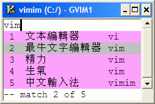
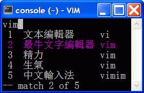

.. header:: VimIM -- Input Method by Vim, of Vim, for Vimmers
            : : : : : : : `中文简体 <vimim.html>`_
            : : : : : : : `中文繁體 <vimim.big5.html>`_
            : : : : : : : `English  <vimim.vim.html>`_
.. footer:: vimim@googlegroups.com at |time| on |date|
            【VimIM ®许可协议：GNU 自由文档许可证 **GFDL** 】
.. |date|   date:: %A, %m/%d/%Y
.. |time|   date:: %H:%M:%S PST
.. ----------------------------------------------------------------
   ============= checkout for anonymous
   svn export   http://vimim.googlecode.com/svn/vimim
   svn export   http://vimim.googlecode.com/svn/trunk/plugin
   ============= checkout for hacks
   svn checkout https://vimim.googlecode.com/svn/vimim
   svn checkout https://vimim.googlecode.com/svn/trunk/plugin
   ---------------------------------------------------------------- v1
             http://vimim.googlecode.com/svn/trunk/plugin/vimim.txt
                 file:///C:/home/xma/svn/svn/trunk/plugin/vimim.txt
   ---------------------------------------------------------------- v2
            http://vimim.googlecode.com/svn/trunk/plugin/vimim.vim
                    file:///C:/home/xma/svn/trunk/plugin/vimim.vim
               http://vimim.googlecode.com/svn/vimim/vimim.vim.html
                       file:///C:/home/xma/svn/vimim/vimim.vim.html
   ---------------------------------------------------------------- v3
   this                     file:///C:/home/xma/svn/vimim/vimim.rst
                   http://vimim.googlecode.com/svn/vimim/vimim.html
                           file:///C:/home/xma/svn/vimim/vimim.html
              http://vimim.googlecode.com/svn/vimim/vimim.big5.html
                      file:///C:/home/xma/svn/vimim/vimim.big5.html
   ----------------------------------------------------------------
      http://vimim.googlecode.com/svn/vim/vimfiles/syntax/2html.vim
              file:///C:/home/xma/svn/vim/vimfiles/syntax/2html.vim
   ----------------------------------------------------------------
                              http://code.google.com/p/vimim/w/list
                              file:///C:/home/xma/svn/wiki/phd.wiki
                       file:///C:/home/xma/svn/wiki/googlecode.wiki
   ----------------------------------------------------------------
                                 http://zh.wikipedia.org/wiki/VimIM
                        file:///C:/home/xma/svn/wiki/wikipedia.wiki
   ----------------------------------------------------------------
                   file:///C:/home/xma/svn/vimim/vimim_logo.gif
           http://vimim.googlecode.com/svn/vimim/vimim_logo.gif
                   file:///C:/home/xma/svn/vimim/vimim_tty_logo.gif
           http://vimim.googlecode.com/svn/vimim/vimim_tty_logo.gif
   ----------------------------------------------------------------
                                       woyouyigeqiguaidemeilidemeng
              http://vimim.googlecode.com/svn/vimim/vimim_dream.png
   ----------------------------------------------------------------
   http://code.google.com/p/ibus/downloads/list
   ============================================ googlecode
   code() { /bin/python ~/script/python/googlecode_upload.py "$@" ;}
   --------------------------------------------
           datafile 四角号码输入法词库
   code -s datafile -p vimim vimim.4corner.txt
           datafile 拼音输入法词库
   code -s datafile -p vimim vimim.pinyin.txt
           datafile 英文输入法词库
   code -s datafile -p vimim vimim.pinyin_quote_sogou.txt
           datafile 搜狗拼音单字双字词库
   code -s datafile -p vimim vimim.english.txt
           datafile 私人信息样本文件
   code -s datafile -p vimim privates.txt
           datafile 中文电报码  http://www.dtc.umn.edu/~reedsj/ctc.html
   code -s datafile -p vimim vimim.ctc.txt
   --------------------------------------------
   cd /home/vimim
   code -s datafile -p vimim vimim.wubi.txt
   code -s datafile -p vimim vimim.wubi98.txt
   code -s datafile -p vimim vimim.wubijd.txt
   code -s datafile -p vimim vimim.cns11643.txt
   code -s datafile -p vimim vimim.phonetic.txt
   code -s datafile -p vimim vimim.array30.txt
   code -s datafile -p vimim vimim.quick.txt
   code -s datafile -p vimim vimim.nature.txt
   code -s datafile -p vimim vimim.cangjie.txt
   code -s datafile -p vimim vimim.xinhua.txt
   code -s datafile -p vimim vimim.pinyin_huge.txt
   code -s datafile -p vimim vimim.12345.txt
   code -s datafile -p vimim vimim.hangul.txt
   code -s datafile -p vimim vimim.erbi.txt
   code -s datafile -p vimim vimim.pinyin_canton.txt
   code -s datafile -p vimim vimim.zhengma.txt
   code -s datafile -p vimim vimim.pinyin_hongkong.txt
   code -s datafile -p vimim vimim.wu.txt
   code -s datafile -p vimim vimim.yong.txt
   code -s datafile -p vimim vimim.pinyin_fcitx.txt
   ----------------------------------------------------------------
   vim 常被称作“程序员的编辑器”，其功能如此强大以致许多人认为它就
   是个完整的IDE。当然，它并不仅仅为程序员而生。对于各种文本编辑而言，
   无论是撰写email还是编辑配置文件，Vim都臻于完美。
   ----------------------------------------------------------------
   VimIM 是一个专门为 vim 玩家开发的嵌入式输入法，只要你的 vim 可以
   显示中文，就可以用 VimIM。便捷的快捷键和独特的输入模式，完美的解
   决了 vim 的中文切换问题。
   ----------------------------------------------------------------

=========================
VimIM —— Vim 中文输入法
=========================

.. :作者: vimim
.. :电子邮箱: vimim@googlegroups.com
.. sidebar:: 目录

   .. contents:: :local:

   —— 子曰：“工欲善其事，必先利其器。”

|
| VimIM 是专为 vim 玩家开发的插件，可作为 vim 内嵌中文输入法。
| 只要您的 vim 能显示中文，您就能用 vim 〖云〗输入中文。
| VimIM 把 vim 的中文编辑潜能，提升到一个全新的高度。
|

==============    ========================================================
vimimhelp　<C-\\>　p
==========================================================================
   错误报告       http://code.google.com/p/vimim/issues/entry
   词库下载       http://code.google.com/p/vimim/downloads/list
   最新主页       http://vimim.googlecode.com/svn/vimim/vimim.html
   最新程式       http://vimim.googlecode.com/svn/vimim/vimim.vim.html
   试用版本       http://vimim.googlecode.com/svn/trunk/plugin/vimim.vim
   官方网址       http://vim.sf.net/scripts/script.php?script_id=2506
   新闻论坛       http://groups.google.com/group/vimim
==============    ========================================================

|

|

概述
====
| 一个文本文件，构成一个中文输入法。插上联网就可以云输入。
| 如果再加上一二个文本文件，无需联网照样敲打中文，随心所欲。
|
| 程式文件用的是 vim script, 天生跨平台（Windows, Mac, Linux）
| 词库文件就是自己的输入法（全拼或双拼，五笔，英文，DIY）
|
| 所谓安装，就是把文本文件扔到 vim 的 plugin 目录之下。
|
| 【拼音★四角】同时插上，可以平行也可以交叉使用，无须切换。
| 【五笔★拼音】同时插上，可以平行使用，动态切换。
|
| 不加设置，不换模式，点热键就可上汉字，是谓〖点石成金〗。
| 如果切换成中文输入模式，也可以将就当前流行的输入法习惯。
|
| 所谓卸载，就是删除文本文件。
|
|

特点
====
* 【独立】不折腾　 **Plug & Play**
* 【自主】不差钱　 **Open Source**
* 【自力】VimIM `〖点石成金〗`_ 　  〖想云就云〗 `CLOUD 云输入`_
* 【更生】VimIM `〖中文输入模式〗`_ 〖即插即用〗 `VimIM 双码输入`_
* 【高性能】中文英文输入和中文英文编辑，不分彼此，融为一体。
* 【低能耗】 `史上最容易卸载的中文输入法`__
* 【和谐☆绿色】 No secret hidden glitch; No strings attached.
* 【自由☆免费】 Free as in freedom, as well as in `free beer!`__

__ http://code.google.com/p/vimim/wiki/AboutManual
__ `VimIM Foundation`_

|
|

..
..
.. http://www.ipedia.org.cn/ip/VimIM
.. http://hyperrate.com/thread.php?tid=9435
   好東西 ... 蠻讚的 ... （台湾）
.. http://cookinglinux.cn/emacs-learning-three-step.html
   我收回vi中输入中文的问题…因为vimim横空出世…
.. http://twitter.com/cbkid/status/1580793545
   vim+vimim哈哈无敌了
.. http://twitter.com/cbkid/status/1580042288
   vimim让vim和中文输入无缝。无敌的插件，终于可以在vim下输入中文了
.. http://twitter.com/ggarlic/status/1417547049
   被vimim深深的震撼了
.. http://friendfeed.com/search?q=vimim
   中文vim用户如果不用这个真是没有天理，你不知道有多好用，
   以后再也不用切换输入法了。可以拿掉输入法了。- xiawinter
.. http://www.douban.com/group/topic/5212341/
   【轻松一笑】 【公告】VimIM 基金会成立维稳办
   这是五一我给自己找到最好的礼物
   如果能在所有文本框调用vim那么电脑没有中文输入法也能混了
.. 最后还是十分感谢作者写出了这么棒的插件，
   使我们这些vim新手更愿意深入学习和使用vim了。
.. http://www.linuxsir.org/bbs/showthread.php?p=1985825#post1985825
   终端中文显示与vim中文输入终于好了。
.. http://groups.google.com/group/xiyoulinux  西邮Linux兴趣小组
   vimim -- 刚见到这个软件时让我目瞪口呆，真是太有创意了，居然利用
   vim的补全功能做了个中文输入法! 可以利用这个小工具在vim中输入中文，
   配合着fbterm 真是太舒服了。词库有很多选择，vi fans 们不可错过。
   vimim的确太强悍了，几个月前看到时我跟楼主一个感觉的，而且可以当辞典用
.. http://bbs.gucas.ac.cn/pc/pccon.php?id=126&nid=31404&s=all
   再无所求 vimim && fireinput  一个浏览器输入，一个vim输入，
   我的生活不就是这两个需要输入中文的地方么？够了
.. http://blog.solrex.cn/articles/vimim.html
   一款非常 cool 的 vim 输入法
.. http://groups.google.com/group/pongba/msg/a53afab1e8b29fa0
   用vimim不会对vim编辑中文文档感到痛苦了；
   我甚至不需要进入X就可以用它来编辑文档了，相当好用，赶快去试试吧
.. http://www.bluedeep.cn/post/89/
   自己也体验了一把，发现原来新版本的VimIM是如此的出色，故转了过来。
   新增了好多很棒也是很必要的功能。成功的超载了其他的外挂输入法。
.. Vimim及时雨 ... 今天才突然发现，现在的效果已经比较能够接受了。
.. http://logs.ubuntu-eu.org/free/2009/06/08/%23ubuntu-tw.html
   用vim的福音来了，在vim中因频繁切换输入法而苦恼的人，现在终于可以解脱了
.. http://bbs.ctex.org/viewthread.php?tid=50002
   我这几天天天对着 VimIm 的代码，慢慢都学了一点点了
.. http://sunday.is-programmer.com/posts/9929.html
   我发现 Vim 和 FireFox 是一对天仙配。
   一个以写 (write/update/delete/insert) 为业。
   一个以读 (read/browse/internet/gmail) 为主。
   男耕女织。男欢女爱。
.. http://linux.chinaunix.net/bbs/viewthread.php?tid=1073521
   想在console下使用中文输入法，去装个vimim是最好不过的了。相当强大。
.. http://chunzi.me/post/tag/vimim
   记得有个 vimim 插件的，于是拿来试试，结果喜出望外。
.. http://logs.ubuntu-eu.org/free/2009/06/08/%23ubuntu-tw.html
   用vim的福音来了，vimim是一种vim外挂插件，
   在vim中因频繁切换输入法而苦恼的人，现在终于可以解脱了
.. http://logs.ubuntu-eu.org/free/2009/06/09/%23ubuntu-tw.html
   我這兩天試了下vimim，真爽不得了，讓我輕鬆許多，再也不煩了。
   為了同時支持拼音及五筆，我把這兩個碼表合並在一起，就成了一個雙用的輸入法。
.. http://blog.sina.com.cn/s/blog_5787e4f30100fh34.html
   最近学习了vimim这个中国小伙做的vim神奇插件，不带外面的输入法，
   就能输入汉字。我下载一试，果然行，其实可以输入任何字符。韩字也可以。
.. http://twitter.com/cirEric/status/3191615510
   推荐一个vim插件: vimim.vim
   不用切换输入法就可以输入中文，支持拼音五笔等等。而且词库可以自由增删。
   实在是居家旅行，杀人防火必备！
.. http://www.linuxsir.org/bbs/thread358272.html
   赞一下作者。看来配合 unicon kernel 可以完全在 console 下工作了
.. http://www.cppblog.com/xfpl-at-hotmail-dot-com/archive/2009/10/12.html
   Vim还有一个功能比较吸引我，就是它自带的语言解释器可以用来写输入法，
   而且Vim的输入法VimIM还很好玩!
.. http://linuxtoy.org/archives/fcitx-for-vim.html
   试试 vim 自己的输入法框架，那叫一个惊艳！
   VimIM 不错, 一直在用 :)
.. http://methodmissing.javaeye.com/blog/495940
   最酷的vim插件，支持各种中文输入法词库和输入习惯，不依赖操作系统的输入法。
.. http://www.linuxsir.org/bbs/thread359160.html
   其中 vimim 不但运用了搜狗云，还可以支持搜狗云所不支持的双拼输入。
.. http://www.douban.com/group/topic/5212341/
   云输入非常精准，有很惊艳的感觉，感觉都有点不可思议了;
   这段话就是用vimim写的，呵呵!
..
.. feedback
..

.. sidebar::  VimIM 玩家评论　Testimonials

  * 众里寻她千百度
  * 最完美的 vim 中文方案
  *  vim + IM == 才子配佳人
  * `vim → 历久弥新`__ 　VimIM → 锦上添花！
  * 这是我见过的最帅的插件__
  * 神插件__
  * `太有创意了 ... 果然闻所未闻 ...`__
  * `彻底终结了中文输入法转换的梦魇`__
  * `因vimim而更喜欢vim了！`__
  * `我感动得都快要哭了`__
  * `居然可以这样，所有的输入法可以去死了。`__
  * `软件很华丽，作者很犀利，VIM 之国人神器。`__

__ http://edt1023.sayya.org/vim/node1.html
__ http://www.douban.com/group/topic/5212341/
__ http://forum.ubuntu.org.cn/viewtopic.php?f=68&p=1135330
__ http://bbs.njupt.edu.cn/cgi-bin/bbstcon?board=Unix&file=M.1235391571.A
__ http://groups.google.com/group/vimim/browse_thread/thread/933ca7066b6fcecd
__ http://cookinglinux.cn/emacs-learning-three-step.html#comment-205
__ http://jouevemau.blogspot.com/2009/04/vim.html
__ http://bbs.chinaunix.net/archiver/tid-1559430-page-7.html
__ http://groups.google.com/group/vimim/browse_thread/thread/3c94d74fcf43bf22

玩家体验
========
| 怎么个玩法？
| VimIM玩家自己的心得体会，就是VimIM最好的用户手则：
|

+ `标题: 挂个贴宣传一下 VimIM 输入法`__
+ `VimIM -- 基于 Vim 的中文输入法 (LinuxGem)`__
+ `强大的VimIM (blog)`__
+ `不折腾——VimIM践行主旨 (wiki)`__
+ `VimIM——利用vim自动补全制作的输入法`__
+ `最早发现〖点石成金〗的VimIM粉丝`__
+ `与抗美援朝风马牛不相及：用VimIM敲韩语`__
+ `排序多个词库文件成为一个词库`__
+ `在VIM里方便的输入中文记VimIM`__

__ http://www.linuxsir.org/bbs/showthread.php?p=2051139#post2051139
__ http://www.linuxgem.org/2009/5/18/VimIM.8422.html
__ http://crane.is-programmer.com/posts/12726
__ http://code.google.com/p/vimim/wiki/Feedback_Suxpert
__ http://bigeagle.yo2.cn/articles/vimim%E2%80%94%E2%80%94%E5%88%A9%E7%94%A8vim%E8%87%AA%E5%8A%A8%E8%A1%A5%E5%85%A8%E5%88%B6%E4%BD%9C%E7%9A%84%E8%BE%93%E5%85%A5%E6%B3%95.html
__ http://freeai.blogspot.com/2009/03/vimim.html
__ http://code.google.com/p/vimim/wiki/DIY_Korean
__ http://code.google.com/p/vimim/wiki/MultiWordListFiles
__ http://www.bibibang.com/group_thread/view/id-12421

|
|

复活节彩蛋
==========
(1) 确认您的 vim 能显示中文： `［科普］如何让Vim支持中文？`_
(2) 首先去 `VimIM 官方网址`__ 下载新版脚本
(3) 然后把 vimim.vim 扔到您的 vim 的 plugin 目录之下

__ http://vim.sf.net/scripts/script.php?script_id=2506

**vim**

  ====  ==============
  vim　<C-\\>　p
  ====================
   1     文本編輯器
   2     最牛文本編輯器
   3     精力
   4     生氣
   5     中文輸入法
  ====  ==============

.. sidebar::  `复活节彩蛋`_   vimim

   .. figure:: vimim_egg.gif

**vimim**

  ====  ==========  =========  ==========================
  vimim　<C-\\>　p
  =======================================================
   1     computer   电脑：     Windows32_builtin_gui
   2     Vim        版本：     702
   3     VimIM      版本：     1056
   4     encoding   编码：     utf-8
   5     fencs      编码：     ucs-bom,utf8,chinese
   6     datafile   词库：     vimim.txt
   7     datafile   词库：     privates.txt
   8     datafile   词库：     四角号码
   9     cloud      搜狗：     想云就云
  ====  ==========  =========  ==========================

|

* vim
* vimim
* vimimvim
* vimimhelp
* vimimdebug
* vimimdefaults

|

【自己动手试一试】

　【目的】VimIM 牛刀小试

　【操作步骤】

  #. 下载新版脚本 vimim.vim__
  #. 把脚本扔到您的 vim 的 plugin 目录之下
  #. 打开 vim （如果用Windows可以双击gVim.exe）
  #. 敲 o 或 i 或 a 进入 vim 插入模式：
  #. 敲 v
  #. 敲 i
  #. 敲 m
  #. 敲 <C-\\>
  #. 〖结果〗 `VimIM logo <vimim_logo.gif>`_
  #. 敲 p
  #. 〖结果〗 输入全部菜单

__ http://vim.sf.net/scripts/script.php?script_id=2506

|
|

内码输入
========
VimIM 内码输入总结

=============  ===========  ================  ===============
   内码         encoding        一键输入         动态列表
=============  ===========  ================  ===============
  UNICODE        utf-8           yes              yes
  GBK            chinese         yes              yes
  BIG5           taiwan          yes              yes
=============  ===========  ================  ===============

|

.. sidebar::  `Unicode 内码输入`_

   .. figure:: vimim_unicode_digit.gif
   .. figure:: vimim_unicode_hex.gif

Unicode 内码输入
----------------
| Unicode 使汉字成为一种理想的电脑语言，没有国界。
| 用 VimIM 玩万国码的前提是 :set encoding=utf-8
| ［科普］ http://zh.wikipedia.org/wiki/Unicode

**万国码输入器**

+ 【广告】精巧细致的标准Unicode输入器，独此一家。
+ 【理想】书同文、文同码、码同键。
+ 【特点】与输入法和词库都无关：以不变应万变。
+ 【用途】内码输入是输入非常用字符的有效途径。
+ 【特点】一个字符对应一个代码，武林高手可以中文盲打。
+ 【TIP】 UNICODE 内码一次性列表　　:call CJK()

| 【演示】Unicode 内码一键输入
| 　　　【例】　十进制：敲　 **39340** 　→　馬
| 　　　【例】十六进制：敲　 **u99ac** 　→　馬
|
| 【示意图】标准统一码动态列表：
| 　　　【例】　十进制：敲　 **3934u** 　→　馬 in 菜单
| 　　　【例】十六进制：敲　  **99au** 　→　馬 in 菜单
|

**万国码一次性列表①** 　 *:call CJK()*

======= =========== ====
decimal hexadecimal char
======= =========== ====
　19968 　　　4e00   一
　39340 　　　99ac   馬
　40869 　　　9fa5   龥
======= =========== ====

|

**万国码一次性列表②** 　 *:call CJK16()*

==== == == == == == == ==
..   0  1  2  3  .. E  F
==== == == == == == == ==
4E00 一 丁 丂 七 .. 与 丏
4E10 丐 丑 丒 专 .. 丞 丟
 　  .. .. .. .. .. .. ..
4EE0 仠 仡 仢 代 .. 仮 仯
4EF0 仰 仱 仲 仳 .. 仾 仿
==== == == == == == == ==

|

.. sidebar::  `GBK 内码输入`_

   .. figure:: vimim_gbk_digit.gif

GBK 内码输入
------------
| GBK  为汉字内码扩展规范，来自中国国家标准代码 GB 13000.1-93
| 用 VimIM 玩GBK标准内码的前提是 :set encoding=chinese
| ［科普］ http://zh.wikipedia.org/wiki/GBK
|

**GBK标准内码输入器**

+ 【广告】短小精悍的标准GBK内码输入器，只此一家。
+ 【特点】与输入法和词库都无关：以不变应万变。
+ 【用途】内码输入是输入非常用字符的有效途径。
+ 【特点】一个字符对应一个代码，不知有无玩GBK的武林高手?
+ 【TIP】 GBK内码一次性列表　　:call GBK()

| 【演示】GBK 标准内码一键输入：
| 　　　【例】　十进制：敲　 **49901** 　→　马　(GB)
| 　　　【例】十六进制：敲　 **uc2ed** 　→　马　(GB)
|
| 【示意图】GBK 标准内码动态列表：
| 　　　【例】　十进制：敲　 **4990u** 　→　马 in 菜单
| 　　　【例】十六进制：敲　  **c2eu** 　→　马 in 菜单
|
|

.. sidebar::  `Big5 内码输入`_

   .. figure:: vimim_big5_digit.gif

Big5 内码输入
-------------
| Big5 已被收录到台湾官方标准的附录当中，版本为Big5-2003
| 用 VimIM 玩Big5标准内码的前提是 :set encoding=taiwan
| ［科普］ http://zh.wikipedia.org/wiki/Big5
|

**Big5标准内码输入器**

+ 【广告】简单明快的标准Big5内码输入器，仅此一家。
+ 【特点】与输入法和词库都无关：以不变应万变。
+ 【用途】内码输入是输入非常用字符的有效途径。
+ 【特点】一个字符对应一个代码，不知有无玩Big5的武林高手?
+ 【TIP】 Big5内码一次性列表　　:call BIG5()

| 【演示】Big5 标准内码一键输入：
| 　　　【例】　十进制：敲　 **45224** 　→　馬　(Big5)
| 　　　【例】十六进制：敲　 **ub0a8** 　→　馬　(Big5)
|
| 【示意图】Big5 标准内码动态列表：
| 　　　【例】　十进制：敲　 **4522u** 　→　馬 in 菜单
| 　　　【例】十六进制：敲　  **b0au** 　→　馬 in 菜单
|
|

数码输入
========
VimIM 数码输入词库样例：

================ =======================================================
    数码                              词库 样本
================ =======================================================
   四角号码      http://vimim.googlecode.com/files/vimim.4corner.txt
   中文电码      http://vimim.googlecode.com/files/vimim.ctc.txt
    交換碼       http://vimim.googlecode.com/files/vimim.cns11643.txt
    五笔划       http://vimim.googlecode.com/files/vimim.12345.txt
================ =======================================================

|

.. sidebar::  `四角号码数码输入`_

   .. figure:: vimim_four_corner_3610.gif
   .. figure:: vimim_four_corner_3111.gif
   .. figure:: vimim_6021272260021762.gif

四角号码数码输入
----------------

  + 【广告】小巧玲珑的四角号码输入器，别无分店。
  + 【科普】 `维基百科　四角号码`__
  + 【四角号码】乃最早的有条有理的汉字编码（1925年）
  + 【四角号码】见字可知码，按码可索字。而且不用拆字。
  + 【四角号码】可以统一“识字、查字、编码、打字”。
  + 【四角号码】可以实现“字典、电脑、手机”一路通。
  + 【技巧】结合音码则是如虎添翼。
  + 【参考】即插即用VimIM双码输入： `拼音★四角号码`_
  + 【自动开启】如果plugin目录下有词库 `vimim.4corner.txt`__
  + 【鸣谢】电脑大师 `Bram`__ 发明推广Vim文本編輯器
  + 【鸣谢】编码大师 `王雲五`__ 发明 `四角號碼檢字法`__
  + 【鸣谢】国文大师 `胡适`__ 推广普及四角号码：

    -  横一垂二三点捺
    -  叉四插五方框六
    -  七角八八九是小
    -  点下有横变零头

__ http://zh.wikipedia.org/wiki/%E5%9B%9B%E8%A7%92%E5%8F%B7%E7%A0%81
__ http://vimim.googlecode.com/files/vimim.4corner.txt
__ http://en.wikipedia.org/wiki/Bram_Moolenaar
__ http://zh.wikipedia.org/wiki/%E7%8E%8B%E9%9B%B2%E4%BA%94
__ http://en.wikipedia.org/wiki/Four_corner_method
__ http://zh.wikipedia.org/wiki/%E8%83%A1%E9%80%82

:【自己动手试一试】:
  #. 【目的】　纯数字　<==>　纯汉字
  #. 下载新版脚本 vimim.vim__
  #. 下载新版词库 vimim.4corner.txt
  #. 把两者扔到 vim 的 plugin 目录之下

__ http://vim.sf.net/scripts/script.php?script_id=2506

:【纯数字　==>　纯汉字】:
  #. 敲 o 或 i 或 a 进入 vim 插入模式
  #. 连敲 6021272260021762
  #. 敲点石成金键:  <C-\\>
  #. 用【空格键】上字，one by one
  #. 结果: “四角号码”四个汉字上屏

:【纯汉字　==>　纯数字】:
  #. 高亮选择“四角号码”四个汉字
  #. 敲见字找码键:  <C-^>
  #. 结果: 6021 2722 6002 1762 上屏

|

中文电报数码输入
----------------
  + 【广告】身轻如燕的中文电码输入器
  + 【科普】 `维基百科　中文电码`__
  + 【中文电码】史上最早的汉字编码（1880年）
  + 【打字】敲数字可以上汉字
  + 【查询】敲汉字可以查电码
  + 【自动开启】如果plugin目录下有词库 `vimim.ctc.txt`__

__ http://zh.wikipedia.org/wiki/%E4%B8%AD%E6%96%87%E7%94%B5%E7%A0%81
__ http://vimim.googlecode.com/files/vimim.ctc.txt

:【自己动手试一试】:
  #. 【目的】　电码　<==>　汉字
  #. 下载新版脚本 vimim.vim__
  #. 下载新版词库 vimim.ctc.txt
  #. 把两者扔到 vim 的 plugin 目录之下

__ http://vim.sf.net/scripts/script.php?script_id=2506

:【电码　==>　汉字】:
  #. 敲 o 或 i 或 a 进入 vim 插入模式
  #. 连敲 00222429719310324316
  #. 敲点石成金键:  <C-\\>
  #. 用【空格键】上字
  #. 结果: “中文电报码”五个汉字上屏

:【汉字　==>　电码】:
  #. 高亮选择“中文电报码”五个汉字
  #. 敲见字找码键:  <C-^>
  #. 结果: 0022 2429 7193 1032 4316 上屏

|
|

汉字笔划数码输入
----------------
| 对于某些生僻字，您有可能并不清楚它的拼音。
| 这时，您可以尝试使用VimIM提供的笔划输入功能。
|
| 样本笔画输入词库主要取自潘罗森笔画输入，为数码。
| 汉字笔画归类为五种：橫1　竖2　撇3　点4　拆5　

+ 【广告】最简单的笔划数码输入器。
+ 【技巧】结合音码则是如虎添翼。
+ 【参考】即插即用VimIM双码输入： `拼音★五笔划`_
+ 【自动开启】如果plugin目录下有词库 `vimim.12345.txt`__

__ http://vimim.googlecode.com/files/vimim.12345.txt

|
|

.. sidebar::  VimIM `CLOUD 云输入`_  　〖想云就云〗

   .. figure:: vimim_dream.png
   .. figure:: cloud_world.gif

CLOUD 云输入
============

【官方介绍】

  * 搜狗云输入跨平台、免安装、兼容各个主流操作系统和浏览器。
  * 基于JavaScript技术，利用Ajax通信原理，采用B/S架构。
  * 强大语言模型(4G　三元模型、trigger模型)和海量词库(200W)。
  * 利用服务器的无限量的存储和计算能力，大幅提升输入准确率。

【点评搜狗】

  * 搜狗整句识别率惊人，但只能在网页里输入，多有不变。(vimim group)
  * 遗憾的就是每打开一个网页都要启动一下搜狗云输入法。(sogou bbs)
  * 应用软件使用搜狗云输入法在版权上没问题。(linuxtoy.org)

【云史】

  (1) 2009年11月2日  `搜狗宣布推出搜狗云输入法`__
  (2) 2009年11月11日 `VimIM 宣誓入云`__
  (3) 2009年11月16日 `史上第一支持五种双拼的云输入法诞生`__
  (4) 2009年12月1日  `推出〖想云就云〗，不换模式，不限输入法`__
  (5) 2009年12月22日 支持〖自己的云〗 python 版本
  (6) 2009年12月25日 支持〖自己的云〗 无词库互联网版本

__ http://pinyin.sogou.com/cloud
__ http://code.google.com/p/vimim/wiki/VimIM_Cloud
__ http://groups.google.com/group/vimim/browse_thread/thread/b90a05c1e37e3448
__ http://code.google.com/p/vimim/wiki/CloudForAll

【必要条件】

  * 入〖云〗必须联网
  * 入〖云〗必须借助 `wget <http://users.ugent.be/~bpuype/wget/>`_
  * 入〖云〗必须使用汉语拼音：全拼或者双拼甚至简拼

.. sidebar::  VimIM `CLOUD 云输入`_ 　双拼

   .. figure:: vimim_shuangpin_abc.gif
   .. figure:: vimim_shuangpin_microsoft.gif
   .. figure:: vimim_shuangpin_nature.gif
   .. figure:: vimim_shuangpin_plusplus.gif
   .. figure:: vimim_shuangpin_purple.gif

【VimIM 云输入】

 (1) 〖全云输入〗每一个输入都〖云〗游

     * 特点：每打一个字母都要向服务器请求一次。
     * 手动开启：可设置 :let g:vimim_cloud_sogou=1
     * 自动开启：

       * Linux  　如果vim plugin目录下没有词库
       * Windows　如果wget.exe置于vim plugin目录之下

 (2) 〖可控性云输入〗每N个输入就〖云〗游

     * 特点：每打N个字母才向服务器请求一次。
     * 设置：:let g:vimim_cloud_sogou=N
     * （长的）诗词曲赋、新闻八卦、完整的句子拜托给〖云〗。
     * （短的）私人信息、英文、词组、单字留给VimIM自己处理。
     * 长短的定义没有统一的国际标准。玩家自己定标准。
     * 例如：如果选项设置为10:　即每敲10个字母以上就丢给〖云〗。
     * 结果：本地词库和搜狗云端词库智能切换。

 (3) 支持〖断字符〗　解决含糊的办法是在含糊的地方贴上标签：

     * 错：xianmeimeidepiaosuifengpiaoyang　=>　先美美地飘随风飘扬
     * 对：xi'anmeimeidepi'aosuifengpiaoyang　=>　 `西安妹妹的皮袄随风飘扬`__

 (4) 支持中文输入模式〖经典动态〗输入风格 （缺省）

     * 如果希望体验搜狗入云的方式：设置 :let g:vimim_cloud_sogou=1
     * 相比之下，VimIM 的〖可控性云输入〗灵活一些。

 (5) 支持中文输入模式〖经典静态〗输入风格

     * 考虑到网速，这是VimIM云输入推荐的输入模式。
     * 设置为 ``:let g:vimim_static_input_style=1``

 (6) 支持“想不云就可以不云”

     * 【特点】在输入后加多一个英文句号，接着敲〖点石键〗
     * 【特点】不受g:vimim_cloud_sogou的设置所限制
     * 【限于】 `〖点石成金〗`_
     * 【例】cloud.  => 云

 (7) 推出〖想云就云〗，不换模式，不限输入法

     * 【卖点】东边日出西边雨，道是无云却有云！
     * 【特点】不限于拼音输入法！不需要设置！
     * 【条件】只需要联网和wget/curl
     * 【限于】 `〖点石成金〗`_
     * 【操作】在输入后加多一个英文逗号，接着敲〖点石键〗
     * 【例】ajiao, => 阿娇
     * 【例】dbrcxby, => 东边日出西边雨
     * 【例】hfpjlswsqy, => 好风凭借力送我上青云

 (8) 推出〖想云就云〗，智能全简拼，整句输入

     * 【特点】自动加断字符号，增加整句输入的确定性
     * 【操作】在输入最后一个字母之前加多一个逗号
     * 【例】laystb,z => 两岸猿声啼不住
     * 【例】ryddddydg,c => 人有多大胆地有多高产

 (9) 支持〖自己的云〗 python 版本

     * 【卖点】自己的云是最好的云
     * 【条件】python
     * 【云样】mycloud package
     * 【即插即用】throw "mycloud" into the plugin directory
     * 【缺省关闭】:let g:vimim_cloud_plugin=0

 (10) 支持〖自己的云〗 无词库互联网版本

      * 【卖点】自己的云永远是最好的云
      * 【特点】不限输入法！不需要词库！
      * 【条件】只需要联网和wget/curl
      * 【缺省关闭】:let g:vimim_cloud_pim=0

__ http://code.google.com/p/vimim/wiki/SingleQuote

|

【设计思路】

 (1) VimIM 决不能被〖云〗和谐
 (2) VimIM 决不能被〖云〗折腾
 (3) VimIM 决不能被〖云〗忽悠
 (4) VimIM 同时坚信：他山之石，可以攻玉

【百花齐放】

 (1) `搜狗官方JavaScript浏览器客户端`__
 (2) `Linux ibus: 多线程，双拼，无阻塞，无候词列表选框`__
 (3) `小小输入法：自然双拼，支持搜狗云输入法`__

__ http://pinyin.sogou.com/cloud
__ http://lihdd.net/?p=277
__ http://bbs.jpu.edu.cn/thread-43589-1-1.html

【玩家福音】

    |  如果想在vim中体验那朵传说中的〖云〗，
    |  只需下载 vimim.vim__ 一个文本文件——即插即用。
    |

__ http://vim.sf.net/scripts/script.php?script_id=2506

.. sidebar:: VimIM `CLOUD 云输入`_ 　全拼和简拼

   .. figure:: vimim_cloud.gif
   .. figure:: vimim_cloud_console.gif

【自己动手试一试】

　【目的】体验腾云驾雾

　【操作步骤】

  +--------------------------------------------------+
  | VimIM `CLOUD 云输入`_  　即插即用　Plug & Play   |
  +====+====================+========================+
  |    |  　Windows 用户    |   　Linux 用户         |
  +----+--------------------+------------------------+
  | ㈠ |  确认电脑联网                               |
  +----+--------------------+------------------------+
  | ㈡ | 下载  wget__       |  确认无词库            +
  +----+--------------------+------------------------+
  | ㈢ | 置wget于plugin之下 |  ..                    |
  +----+--------------------+------------------------+
  | ㈣ |  下载新版脚本 vimim.vim__  并置于plugin之下 |
  +----+---------------------------------------------+
  | ㈤ |  打开 vim                                   |
  +----+---------------------------------------------+
  | ㈥ |  敲 o 或 i 或 a 进入 vim 插入模式           |
  +----+---------------------------------------------+
  | ㈦ |  敲　haofengpingjielisongwoshangqingyun     |
  +----+---------------------------------------------+
  | ㈧ |  敲 `〖点石成金〗`_ 键 <C-\\>               |
  +----+---------------------------------------------+
  | ㈨ |  默念：〖云〗〖云〗〖云〗                   |
  +----+---------------------------------------------+
  | ㈩ |  〖上屏结果〗 好风凭借力送我上青云          |
  +----+---------------------------------------------+

__ http://users.ugent.be/~bpuype/wget/
__ http://vim.sf.net/scripts/script.php?script_id=2506

|
|

拼音输入
========
VimIM 拼音输入词库样例：

================ =======================================================
    拼音                              词库 样本
================ =======================================================
  汉语拼音       http://vimim.googlecode.com/files/vimim.pinyin.txt
  拼音大词库     http://vimim.googlecode.com/files/vimim.pinyin_huge.txt
  fcitx大词库    http://vimim.googlecode.com/files/vimim.pinyin_fcitx.txt
  搜狗单双字     http://vimim.googlecode.com/files/vimim.pinyin_quote_sogou.txt
================ =======================================================

VimIM 拼音输入总结：

- 【标点翻页】逗号/句号 或者 减号/等号。翻页键可调。
- 【数字键】数字键上字。数字标签与数字选字一一对应。
- 【空格键】直接上汉字，或上空格。
- 【回车键】或无缝上英文，或回车。
- 【无缝混排】支持 `无缝混排`_
- 【退格键】一键改错 （开启可设）:let g:vimim_smart_backspace=2
- 【<C-H>】（点石成金） `整句输入`_ 重新匹配
- 【中文数字】（静态模式）i2009　=>　二〇〇九　　I2009　=>　贰零零玖
- 【中文量词】（静态模式）i5t　=>　五吨　　id8　=>　第八
- 【大块英文】敲 CTRL-6 动态切换中英文输入模式。
- 【智能模糊匹配】 （缺省开启）
- 【可控词频调整】 （缺省开启）
- 【通配符匹配】用星号键＊匹配任意字符串或空串 （缺省关闭）
- 【输入风格】 `〖中文输入模式〗`_  经典动态输入风格 （缺省开启）
- 【开启静态模式】可设 :let g:vimim_static_input_style=1

========================   =============================================
【双拼】 选择开启
========================================================================
  智能ABC双拼              :let g:vimim_shuangpin_abc=1
  微软双拼                 :let g:vimim_shuangpin_microsoft=1
  自然码双拼               :let g:vimim_shuangpin_nature=1
  拼音加加双拼             :let g:vimim_shuangpin_plusplus=1
  紫光双拼                 :let g:vimim_shuangpin_purple=1
========================   =============================================

|
|

.. sidebar:: VimIM `五笔输入`_ 【五笔★拼音】　

   .. figure:: wubi_pinyin.gif

五笔输入
========
VimIM 五笔输入词库样例：

================ =======================================================
    五笔                              词库 样本
================ =======================================================
   五笔 86       http://vimim.googlecode.com/files/vimim.wubi.txt
   五笔 98       http://vimim.googlecode.com/files/vimim.wubi98.txt
   极点五笔      http://vimim.googlecode.com/files/vimim.wubijd.txt
================ =======================================================

VimIM 五笔输入总结：

- 【数字键】上汉字，永远对应数字标签。
- 【标点翻页】逗号/句号 或者 减号/等号。翻页键可调。
- 【空格键】上汉字，开始新的一轮五笔连打。或上空格。
- 【回车键】或无缝上英文，或回车。
- 【无缝混排】支持 `无缝混排`_
- 【退格键】一键改错 （开启可设）:let g:vimim_smart_backspace=2
- 【英文输入】敲 CTRL-6 动态切换中英文输入模式。
- 【点石成金】四码匹配，逐词上屏。
- 【通配符匹配】用 z 匹配壹个字符 （缺省关闭）
- 【输入风格】 `〖中文输入模式〗`_  经典动态输入风格
- 【五笔连打】

  + 符合当前流行的五笔输入法习惯
  + 四码自动上屏
  + 空码（不存在的编码）时清除已输入编码
  + 【缺省开启】:let g:vimim_wubi_non_stop=1

- 【五笔★拼音】

  + 【五笔输入】敲 CTRL-6 动态切换五笔输入模式。
  + 【拼音输入】敲 CTRL-6 动态切换拼音输入模式。
  + 〖特点〗 plug & play 即插即用　动态切换

    (1) 形码（例如：五笔）输入永远独立，插上就可以用。
    (2) 音码（例如：拼音）输入永远独立，插上就可以用。
    (3) 平行使用，两个输入法和平共处，互不干扰。

|
|

英文输入
========
| 英文可以给VimIM的主词库锦上添花。
|
| 【优点】　精确定位外国人名、外国地名、科学术语
| 【样品】　obama 奥巴马 欧巴马 #
| 【操作】　㈠加入主词库　㈡:sort u排序　㈢存盘
| 【设置】　:let g:vimim_english_in_datafile=1
| 【成功案例】　 `外国政要译名之争的解决方案`__

__ http://code.google.com/p/vimim/wiki/VimIM_English_Input

+-----------------------------------------------------+
|                  英文输入样本文件                   |
+=====================================================+
| http://vimim.googlecode.com/files/vimim.english.txt |
+-----------------------------------------------------+

|
|

.. sidebar:: 和谐软体　 **Together in Harmony**

  - 主要问题：旧版缺省关闭所有选项：烦不胜烦
  - 解决方案：新版自动开放常用选项：柳暗花明
  - 理论基础：“不折腾”　 *BuZheTeng*

各式流行输入
============
您可以挑选任何输入法：音码、形码、音形码、笔画码等等。

================ =======================================================
    音码                              词库 样本
================ =======================================================
    自然         http://vimim.googlecode.com/files/vimim.nature.txt
    注音         http://vimim.googlecode.com/files/vimim.phonetic.txt
    吴语注音     http://vimim.googlecode.com/files/vimim.wu.txt
    粤语拼音     http://vimim.googlecode.com/files/vimim.pinyin_canton.txt
    香港拼音     http://vimim.googlecode.com/files/vimim.pinyin_hongkong.txt
================ =======================================================

================ =======================================================
    形码                              词库 样本
================ =======================================================
   仓颉          http://vimim.googlecode.com/files/vimim.cangjie.txt
   郑码          http://vimim.googlecode.com/files/vimim.zhengma.txt
   速成          http://vimim.googlecode.com/files/vimim.quick.txt
   行列          http://vimim.googlecode.com/files/vimim.array30.txt
   新华          http://vimim.googlecode.com/files/vimim.xinhua.txt
================ =======================================================

================ =======================================================
   音形码                             词库 样本
================ =======================================================
   二笔          http://vimim.googlecode.com/files/vimim.erbi.txt
   永码          http://vimim.googlecode.com/files/vimim.yong.txt
================ =======================================================

.. http://groups.google.com/group/vimim/files
   If the following download URL does not work for you, please
   (1) goto http://groups.google.com/group/vimim/files
   (2) right-click on the title of the desired file
   (3) select *Save link as* (in Firefox)
           or *Save target as* (in Internet Explorer)

|
|
|

VimIM 双码输入
==============
| VimIM 可使多种输入方式和谐并存，互不冲突而又相互补充。
| VimIM 充分发挥个人的知识潜能，达到“人尽其能、物尽其用”的境界。

+ 【用途】单码（音码或形码）为主，双码（音码加形码）为辅。
+ 【单码特点】二个单码可混合使用，不用切换。
+ 【双码特点】既不要求音码部分完整，也不要求形码部分完整。
+ 【混合特点】双码优势互补，各尽所能。
+ 【优点】用自己熟悉的输入方式，用自己定的规矩：怎么混也不乱！
+ 【结论】最好的输入法是自己的输入法。

|
| 【主要问题】
|       经典音码：一音多字，一字多音。
|       流行形码：难学难记，万码奔腾。
|       现代混码：难记难学，各自为战。
|
| 【解决方案】
|       【前提】模模糊糊知道两种中文输入方式，但都不精通。
|       　　　　第一步：寻找自己有点熟悉的输入方式
|       　　　　第二步：结合与之相应的输入法词库
|       　　　　第三步：按照自己定的规矩：想怎么打，就怎么打！
|       【答案】模糊 + 模糊 = 精确
|       【原因】VimIM 帮您转换词库里没有，但您心里有的输入码。
|
| 【理论基础】
|       【通俗】负负得正
|       【学术】近代数学模糊集合理论
|
|

.. sidebar:: `VimIM 双码输入`_ —— `拼音★四角号码`_ 　【字】

   .. figure:: vimim_diy_im_single_char_1.gif
   .. figure:: vimim_diy_im_single_char_2.gif
   .. figure:: vimim_diy_im_single_char_3.gif
   .. figure:: vimim_diy_im_single_char_4.gif

拼音★四角号码
--------------

即插即用VimIM双码输入的特点是：

(1) 音码（例如：汉语拼音）输入永远独立，插上就可以用。
(2) 数码（例如：四角号码）输入永远独立，插上就可以用。
(3) 平行使用，两个输入法和平共处，互不干扰，无须切换。
(4) 交叉使用，两个输入法各尽所能，优势互补，合二为一。

====================== ===================================================
  VimIM 双码输入                          词库 样本
====================== ===================================================
  汉语拼音             http://vimim.googlecode.com/files/vimim.pinyin.txt
  四角号码             http://vimim.googlecode.com/files/vimim.4corner.txt
====================== ===================================================

**天仙配** —— “拼音输入”配“四角号码输入”

| VimIM 回避拼音重码的方法是形音结合，输入生僻字则
| 是直接用形码。形码的来源可以由玩家自己决定。玩家
| 完全可以用自己喜欢的甚至自己发明的形码。VimIM 推
| 荐的是四角号码。
|
| 当然，四角号码也有点学习曲线，但是，四角号码与我
| 们的Vim一样，值得一学。学好了终生获益。
|
| VimIM 提供简单的方式，有机结合这一对鸳鸯，随叫随到。
| 玩家也许可以实现用拼音输入中文的最高境界：中文盲打。

.. sidebar:: `VimIM 双码输入`_ —— `拼音★四角号码`_ 　【词】

   .. figure:: vimim_diy_im_double_char_5.gif
   .. figure:: vimim_diy_im_double_char_6.gif
   .. figure:: vimim_diy_im_double_char_7.gif
   .. figure:: vimim_diy_im_double_char_8.gif

|
| 【操作】
|     (1)　抓上汉语拼音词库，扔到您的 vim plugin 目录之下
|     (2)　抓上四角号码词库，扔到您的 vim plugin 目录之下
|

======= ========== ==================================
 词库     输入码                对应汉字
======= ========== ==================================
　　A   　　ma     妈　麻　馬　骂　…　马　蚂　码　瑪
　　B   　　71     厚　医　反　厨　…　唇　辱　馬　愿
======= ========== ==================================

|

敲中文
 - 例如：插入单个汉字“馬”，可以任选如下三种方式:
 - 　　　㈠ 单码（音码） 可敲入 ma 或 ma3
 - 　　　㈡ 单码（数码） 可敲入 71 或 713 或 7132
 - 　　　㈢ 双码（双码） 可敲入 ma71 或 ma7132
 - 　　　㈤ 双码（双码） 可敲入 mjads （快键）
 - 【注】三种输入方式互相独立，互不冲突，互相补充。

|

【字】
  前一个音码长度可以任意，后前一个数码长度可以任意

==========   ============  ==================  =============
  输入法          插入             显示           菜单选择
==========   ============  ==================  =============
 纯音码        m a         　妈　骂　馬　...        21 个
 纯数码        7 1         　唇　辱　馬　...       192 个
  双码         m a 7 1       　　　　馬　　          唯一
==========   ============  ==================  =============

|

【词】
  前一个字长度任意，后一个字长度任意

==========   ============  ==================  =============
  输入法          插入             显示           菜单选择
==========   ============  ==================  =============
 纯音码       shanzhai     　　山寨　山寨化         4 个
 纯数码       2277 3090    　　山　寨　永　       7+8 个
  双码        sh22zh30       　山寨　              唯一
==========   ============  ==================  =============

|

【点评】
    (1) 拼音配四角原本用于演示即插即用 `VimIM 双码输入`_
    (2) 不料无心插柳，歪打正着，发现了一对天仙配。
    (3) VimIM 靠算法把毫不相关的音码和数码结合成为一对鸳鸯：

        + 鸳（音码）鸯（数码）平时各自觅食，互不相依。
        + 一旦有需要：比翼双飞，合二为一。

|
|

.. sidebar::  即插即用 `VimIM 双码输入`_ —— `拼音★五笔划`_

   .. figure:: vimim_diy_im_pinyin_12345_a.gif
   .. figure:: vimim_diy_im_pinyin_12345_b.gif

拼音★五笔划
------------
即插即用VimIM双码输入的特点是：

(1) 音码（例如：汉语拼音）输入永远独立，插上就可以用。
(2) 数码（例如：五笔划）输入永远独立，插上就可以用。
(3) 平行使用，两个输入法和平共处，互不干扰，无须切换。
(4) 交叉使用，两个输入法各尽所能，优势互补，合二为一。

|
| 【操作】
|     (1)　抓上汉语拼音词库，扔到您的 vim plugin 目录之下
|     (2)　抓上五笔划词库，扔到您的 vim plugin 目录之下
|

====================== ==================================================
  VimIM 双码输入                          词库 样本
====================== ==================================================
  汉语拼音             http://vimim.googlecode.com/files/vimim.pinyin.txt
    五笔划             http://vimim.googlecode.com/files/vimim.12345.txt
====================== ==================================================

|
| 【结果】

=======   ==============  ==============  =====================
  ..          汉语拼音       五笔划         拼音★五笔划
=======   ==============  ==============  =====================
  马            ma           551             ma551
  馬            ma         　1211254444    　ma12112
=======   ==============  ==============  =====================

|
|

输入法林林总总
==============
|

中文输入的最高境界
------------------
The highest realm of Chinese input:

====  ===================   =================================
 1     书同文、文同码       VimIM 首选  Unicode__
 2     和谐、绿色           VimIM 坚信 `文本文件，天下无敌`__
 3     不切换输入状态       VimIM 首创 `〖点石成金〗`__
 4     不改变输入习惯       VimIM 确认 `天生跨平台`__
 5     手机电脑一路通       VimIM 推荐 `四角号码数码输入`_
 6     自创中文输入法       VimIM 演示 `VimIM 双码输入`_
 7     闭目养神             VimIM 体验 `中文盲打`_
 8     美女如〖云〗         VimIM 追求 `CLOUD 云输入`_
====  ===================   =================================

__ `Unicode 内码输入`_
__ `概述`_
__ http://code.google.com/p/vimim/wiki/OneKey
__ `VimIM Mapping`_

|

中文盲打
--------
【目标】

+ 求准不求快
+ 不学习不培训：因为用的是自己的输入法
+ 闭〖目〗养〖神〗

  - 一边输入中文，一边休息眼睛
  - “得神者昌，失神者亡” ——《内经》

【实现方式】

+ VimIM　 `整句输入`_
+ VimIM　 `逐词匹配`_ 　之 ㈠ 句号分隔，自己定匹配
+ VimIM　 `CLOUD 云输入`_ 之 ㈠ 〖可控性云输入〗

【测试】

====  =======================  ===============================
 1    〖云输入〗                woyouyigeqiguaidemeilidemeng
 2    〖英文输入〗              i have a dream.
 3    〖拼音输入〗              wo.you.yige.meng
 4    〖即插即用双码输入〗      magic.sz2230.s9020.nfofo.ythc
====  =======================  ===============================

|
|

词库管理
--------
【无词库】

  *  不联网：利用 VimIM `内码输入`_
  *  联网：　即插即用 VimIM `CLOUD 云输入`_

【带词库】

  * 〖特点〗 plug & play
  * 用VimIM 打字，只需一个词库。玩家可以从VimIM 词库样例中挑选。
  * 如果希望分开保管 `私人信息`_  ：可以加上 privates.txt
  * 如果想玩 即插即用 `VimIM 双码输入`_  ：可以同时插入两个词库文件：

    + `拼音★四角号码`_
    + `拼音★五笔划`_

  * 如果想玩〖即插即用〗〖动态切换〗可以同时插入两个词库文件：

    *  五笔★拼音
    *  二笔★拼音
    *  仓颉★拼音
    *  郑码★拼音
    *  速成★拼音
    *  行列★拼音
    *  新华★拼音

【词库位置】

  * 〖特点〗 多个词库： set & play
  * 用户可以随意设置自己词库的位置：（例如）

    * ``:let g:vimim_datafile="path_to_your_own_data_file"``
    * ``:let g:vimim_datafile_private="path_to_your_own_privates_file"``
    * ``:let g:vimim_datafile_4corner="path_to_your_own_digital_im_file"``

【多功能词库】

  * 〖特点〗 一个词库： set & play
  * 用户可以在一个词库中混合几个输入法：（例如）

    * ``:let g:vimim_datafile_has_english=1``
    * ``:let g:vimim_datafile_has_pinyin=1``
    * ``:let g:vimim_datafile_has_4corner=1``

|
|

词库格式
--------
VimIM 词库是开放式的纯文本文件，左码右字。

====== ====== ======
输入码  空格   汉字
====== ====== ======
 mali    ..    馬力
====== ====== ======

| 既可一行多字 （将其中第二列和第三列重复）
| 也可一码多行。例如：

=======  ============
ma       妈
ma       马 馬 吗 碼
ma4      骂
-------  ------------
china    中国
chinese  中国人
chinese  中文    汉字
=======  ============

|
| VimIM `词库格式`_ 简单灵活。词库只要排好序就可以用。
| 排序易如反掌：在 『Vim 命令行模式』下，直接调用　 *:sort u*
|
| VimIM 对词库的设计是简单灵活，充分利用vim的编辑功夫。
|
|   比方说，我们想混合使用拼音词库和英文词库：
|
|   第一步：下载 vimim.pinyin.txt__
|   第二步：下载 vimim.english.txt__
|   第三步：vim vimim.pinyin.txt
|   第四步：　　:r  vimim.english.txt
|   第五步：　　:sort u
|   第六步：　　:wq
|
|   结果是我们做了一个新的词库: vimim.pinyin.txt
|   也就是说，我们创造了一个我们自己的中文输入法。
|
|

__ http://vimim.googlecode.com/files/vimim.pinyin.txt
__ http://vimim.googlecode.com/files/vimim.english.txt

私人信息
--------
| 个人隐私数据最好分开保管，不应与主词库混在一起。
| VimIM 玩家因之可以放心交换 VimIM 主词库。

【制作】 可以参考样本文件：只需符合 VimIM `词库格式`_

  +-----------------------------------------------------+
  |                     私人信息样本文件                |
  +=====================================================+
  |    http://vimim.googlecode.com/files/privates.txt   |
  +-----------------------------------------------------+

【存放】

  | 既可直接把 privates.txt 扔到您的 vim 的 plugin 目录之下
  | 也可在您的 .vimrc 中指定您的私人信息文件：
  | ``:let g:vimim_datafile_private="path_to_your_own_privates_file"``

【特点】

  (1) 私人信息文件 plug & play 以及 remove & gone
  (2) 私人信息文件可以不排序。
  (3) 私人信息为完全匹配。

【小技巧】

  | **活学活用，利用 VimIM 管理记忆私人信息**
  |
  | 号称赶英超美的中文输入法其实并不那么玄而又玄。
  | 多如牛毛的中文输入专利大多不过是一个字符映射的定义而已。
  |
  | VimIM 自成体系，别具一格。而今后来居上，鹤立鸡群，何也?
  | 因为我们把定义字符映射的权力完完全全交给玩家自己。
  | 因为我们坚信，自己的输入法才是最好的输入法。
  |
  | 字符映射并不限于 English => 中文。
  | 字符映射也可以为 English => English.
  |
  | 理解到这样一个高度，我们就可以激发自己的想像力，信马由缰。
  | 作者特此抛砖引玉，举一个利用 VimIM 管理记忆私人信息的例子：

【自己动手试一试】

　【目的】把 password 从私人信息文件复制到 clipboard 剪贴板

　【操作步骤】

  #. 下载新版脚本 vimim.vim__
  #. 下载私人信息样本文件 privates.txt
  #. 把这二个文件扔到您的 vim 的 plugin 目录之下
  #. 打开 vim （如果用Windows可以双击gVim.exe）
  #. 敲 o 或 i 或 a 进入 vim 插入模式：
  #. 敲 password
  #. 敲 <C-\\>
  #. 敲 j
  #. 敲 j
  #. 敲 c
  #. 【结果】 第三个 password 被复制到 cilpboard 剪贴板。

__ http://vim.sf.net/scripts/script.php?script_id=2506

|
|

VimIM Mapping
=============
㈠ 【经典】VimIM only needs maximum two hot keys.

(1) 按 <Ctrl-\> 在非中文模式直接出选择。
(2) 按 <Ctrl-6> 进入中文输入模式，此后按空格出选择。

+------------------------+----------------------------+-----------------------+
|   Vim 模式             |  敲　CTRL-6                | 　敲　CTRL-\\         |
+========================+============================+=======================+
| vim 正常模式           | 　　Vim 缺省功能           |  Vim 缺省功能         |
+------------------------+----------------------------+-----------------------+
| vim 插入模式    　     | 开启 `〖中文输入模式〗`_   |  `〖点石成金〗`_      |
+------------------------+----------------------------+-----------------------+
| `〖中文输入模式〗`_    | 关闭 `〖中文输入模式〗`_   | `中文标点`_ 动态切换  |
+------------------------+----------------------------+-----------------------+
| vim 可视模式         　| 　　 `见字找码`_           | `动态造词`_  （批量） |
+------------------------+----------------------------+-----------------------+

|
| 【小技巧】玩家可以自定义热键：
| 　　　　　例如在.vimrc中，定义 CTRL-L 为 CTRL-6
| 　　　　　imap<silent><C-L>   <Plug>VimimChineseToggle
|
| 【小技巧】因为GUI版vim (GVim) 支持CTRL-SPACE 键的mapping,
| 　　　　　GVim 玩家可以赋予 CTRL-SPACE 和 CTRL-6 相同的定义：
| 　　　　　:let g:vimim_ctrl_space_as_ctrl_6=1
|
|

㈡【反经典】 This is another way to use VimIM, using one map only.

(1) 特点： `〖点石成金〗`_ 的另类玩法，一键多用，一石多鸟
(2) 设置：

    + :let g:vimim_ctrl_6_as_onekey=1（vim插入模式）
    + :let g:vimim_ctrl_6_as_onekey=2（包括g:vimim_tab_as_onekey）
    + :let g:vimim_ctrl_6_as_onekey=3（包括vim正常模式）

(3) 使用：

    + 按 <Ctrl-6> 进入 〖点石成金〗 `无模式之模式`_
    + 高亮选择汉字字串，按 <Ctrl-6> 可以 `见字找码`_
    + 高亮选择空白位置，按 <Ctrl-6> 可以 `动态造词`_

|

+------------------------+---------------------------------+
|   Vim 模式             |   敲　 CTRL-6                   |
+========================+=================================+
| vim 正常模式           | 开启  〖点石成金〗输入模式      |
+------------------------+---------------------------------+
| vim 插入模式    　     | 开启  〖点石成金〗输入模式      |
+------------------------+---------------------------------+
| vim 可视模式         　| 　`见字找码`_ 　　 `动态造词`_  |
+------------------------+---------------------------------+
|    <Esc>               | 关闭  〖点石成金〗输入模式      |
+------------------------+---------------------------------+

|
|

.. sidebar::  `〖点石成金〗`_ 　(*OneKey*)

   .. figure:: vimim.gif

〖点石成金〗
============
概要
----

| 英文字母为“石”，中文汉字为“金”：是谓〖点石成金〗
| 有玩家叹曰：使用〖点石成金〗，点出来的不是汉字，是惊艳。
|
| 卖点：保持 vim 缺省工作环境，没有所谓“状态”切换。
| 　　　在英文环境下玩中文：想输入就输入，想搜索就搜索。
|

【自己动手试一试】

　【目的】感觉一下〖点石成金〗

　【操作步骤】

  #.  打开 vim （如果用Windows可以双击gVim.exe）
  #.  敲 o 或 i 或 a 进入 vim 插入模式
  #.  连敲四键: v i m <C-\\>
  #.  敲 j  光标向下移动
  #.  敲 k  光标向上移动
  #.  敲 h  向上翻页
  #.  敲 l  向下翻页

|

【主要特点】

  | 【破旧立新】让中文输入回归自然
  | 【无模式转化】无“状态”切换

  + vim 插入模式：

    - 【云输入】最方便的 `CLOUD 云输入`_
    - 〖想云就云〗不换模式，不限输入法:  using comma
    - 【整句输入】敲中文如同敲英文
    - 〖中文标点〗可点击英文标点直接转换。
    - 【匹配提醒】缺省匹配，以及总匹配数
    - 【万国码】 `Unicode 内码输入`_ 直接上屏
    - 【国标码】 `GBK 内码输入`_ 直接上屏
    - 【大五码】 `Big5 内码输入`_ 直接上屏

  + 菜单操作：

    - 【中文搜索】可用 VimIM `中文搜索`_
    - 【一键改错】可敲 ``d`` 键 for delete
    - 【翻页选字】可用 vi 快捷键 `翻页选字`_
    - 【以词定字】可按 ``[`` 或 ``]`` 键
    - 【汉字上屏】也可敲 ``y`` 键或点石键

|

【点石键】OneKey 三者择一：

  (1) 〖CTRL-\\〗　　　　　　 `VimIM Mapping`_

     + 【特点】打字搜索，中文英文没有区别。

  (2) 〖Tab〗（插入模式）

     + 【优点】Tab键方便省力
     + 【反经典】用Tab键上汉字，用空格键确认
     + 【智能】该出码时就出码，没码时出Tab
     + 【开启可设】 :let g:vimim_tab_as_onekey=1
     + 【小技巧】开启后，<CTRL-\\>键变成<Tab>键
     + 【推荐】OneKey 传统玩家

  (3) 〖CTRL-^〗 （参见 `无模式之模式`_ ）

|

无模式之模式
------------
| 如果愿意，OneKey 可以作为VimIM唯一的中文输入模式。
| 这也许是传说中的 `无模式之中文输入模式`__ 。
| 也可以当作 `〖点石成金〗`_ 的另类玩法。缺省关闭。
|

__ http://code.google.com/p/vimim/wiki/OneKey

+ 【点石键】可以定为 CTRL-^

  - 【反经典】把OneKey当作VimIM的中文输入模式。
  - 【推荐】OneKey 专职玩家

    - ㈠插入模式

      + 【点石键】与Vim的标准IM键CTRL-6基本一致
      + 【开启可设】:let g:vimim_ctrl_6_as_onekey=1

    - ㈡正常模式

      + 【点石键】与插入模式的一模一样
      + 【特点】把光标置于word任一字母下，一键点出菜单。
      + 【开启可设】:let g:vimim_ctrl_6_as_onekey=3

+ 【开启】—— 敲【点石键】
+ 【关闭】—— 敲<Esc>
+ 【功能】

  - 〖经典〗空格键上汉字，回车键上英文。
  - 〖无缝混排〗支持 `无缝混排`_
  - 〖空格键〗出菜单，或上汉字，或上空格，或上中文标点。
  - 〖回车键〗或无缝上英文，或回车，或上空格（after .,）
  - 〖状态显示〗 noruler

|
|

输入记忆
--------
- 【卖点】Yes, VimIM can recycle!
- 【目的】重复利用用户输入，省时省力!
- 【方式之一】利用 Ctrl-N
 
  - 【特点】同一字母开头的输入只记住一次
  - 【操作】在输入一个字母后，按<Ctrl-N>
  - 【缺省开启】:let g:vimim_smart_ctrl_n=1

- 【方式之二】利用 Ctrl-P

  - 【特点】记住用户所有输入记录
  - 【操作】随便输入几个印象中的编码后，按<Ctrl-P>
  - 【缺省关闭】:let g:vimim_smart_ctrl_p=0

|

**不怕不识货，只怕货比货**

| 比方说，我们想敲以下14个字，前后敲两遍：
| 
|     重复打字不光荣，
|     光荣打字不重复。
| 
| 用谷歌拼音，搜狗拼音，微软拼音：
| 
|  $　 chongfu dazi bu guangrong
|  $　 guangrong dazi bu chongfu
|  $　
|  $　 (keep typing others) ...
|  $　
|  $　 chongfu dazi bu guangrong
|  $　 guangrong dazi bu chongfu
| 
| 
| 用VimIM中文输入法：
| 
|  $　 chongfu dazi bu guangrong
|  $　 g<C-N> d<C-N> bu c<C-N>
|  $　
|  $　 (keep typing others) ...
|  $　
|  $　 cf<C-P> dz<C-P> bu gg<C-P>
|  $　 g<C-N> d<C-N> bu c<C-N>
|
|

.. sidebar::  VimIM 整句输入，无“状态”切换

   .. figure:: vimim_sentence_match.gif

整句输入
--------
| 【前景】VimIM 中文盲打的理论基础。
| 【输入】正常英文句子结构，以 **句号** 结尾。
| 【卖点】敲中文如同敲英文。
| 【特点】无状态切换，亦无所谓智能组句，好歹可以上字。
| 【操作】连续输入短句或长句后按〖点石成金〗键。
| 【上屏】连续敲空格键或数字键选择匹配，手到字来。
| 【限于】 `〖点石成金〗`_
|

【演示】无“状态”切换，敲 VimIM 经典『我有一个梦』

===========================   =========================
                       我有一個夢
=======================================================
【英文输入法】                  i have a dream.
【拼音输入法】                  wo you yige meng.
【粤语输入法】                  ngoh yau yat goh mung.
【吴语输入法】                  ngu qyoe iq qku qmon.
【五笔输入法】                  trde ggwh ssqu.
【郑码输入法】                  m gq avov ffrs.
【仓颉输入法】                  hqi kb m ol ddni.
【自然输入法】                  wop yb yg' mgx.
===========================   =========================

|

【自己动手试一试】

　【目的】敲 VimIM 经典『我有一个梦』

　【操作步骤】

  #. 打开 vim （如果用Windows可以双击gVim.exe）
  #. 敲 o 或 i 或 a 进入 vim 插入模式
  #. （如用拼音词库）输入:  wo you i1g meng.
  #. （在句号后面）敲点石成金键:  <C-\\>
  #. 敲【空格键】或【数字键】上字: wo　　=>　我
  #. 敲【空格键】或【数字键】上字: you　 =>　有
  #. 敲【空格键】或【数字键】上字: i1g　 =>　一个
  #. 敲【空格键】或【数字键】上字: meng　=>　梦

|
|

.. sidebar::  `逐词匹配`_

   .. figure:: vimim_word_by_word.gif
   .. figure:: vimim_part_by_part.gif

逐词匹配
--------
| 【输入】一气呵成输入大块编码。
| 【特点】先显示，再确认。
| 【上屏】连续敲空格键选择匹配，手到字来。
| 【卖点】打汉字眼花不缭乱，保护视力!
| 【限于】 `〖点石成金〗`_
|

㈠ 句号分隔，自己定匹配：

| 【特点】 逐词匹配，逐词上屏。
| 【特点】 可以结合 `智能模糊匹配`_
| 【演示】 一口气输入一长串用句号分隔的编码。
| 　　　【输入】pinyin.shuru.si4.jiao3.hao4.ma3.hhyy
| 　　　【匹配】拼音输入四角号码花好月圆
|

㈡ 无句号分隔，一气呵成：

| 【特点】 逆向最大匹配，逐词上屏。
| 【演示】 一口气输入一长串拼音：
| 　　　【输入】jiandaolaoshiwenshenghao.
| 　　　【匹配】jiandao见到　laoshi老师　wensheng问声　hao好
|

【自己动手试一试】

　【目的】 一口气输入八个汉字: 我最喜欢的浏览器

　【操作步骤】

  #.  打开 vim （如果用Windows可以双击gVim.exe）
  #.  敲 o 或 i 或 a 进入 vim 插入模式
  #.  连敲: wozuixihuandeliulanqi.
  #.  不间断继续敲点石成金键:  <C-\\>
  #.  敲【空格键】或【数字键】上字: wo 　　　=> 我
  #.  敲【空格键】或【数字键】上字: zui　　　=> 最
  #.  敲【空格键】或【数字键】上字: xihuan 　=> 喜欢
  #.  敲【<C-H>】重新挑选 （参见 `其余选项`_ ）
  #.  敲【空格键】或【数字键】上字: de 　　　=> 的
  #.  敲【空格键】或【数字键】上字: liulanqi => 浏览器

|

㈢ 无句号分隔，每四数码上屏 （四角号码）

| 【特点】 四码匹配，逐词上屏。
|
| 【四角号码演示】
|   (1) 敲 o 或 i 或 a 进入 vim 插入模式
|   (2) 连敲 6021272260021762
|   (3) 敲点石成金键:  <C-\\>
|   (4) 敲【空格键】或【数字键】上字，one by one
|   (5) 结果: “四角号码”四个汉字上屏
|

㈣ 无句号分隔，每四编码上屏 （五笔）

| 【特点】 四码匹配，逐词上屏。
|
| 【五笔演示】
|   (1) 敲 o 或 i 或 a 进入 vim 插入模式
|   (2) 连敲 trdeggwhssqu
|   (3) 敲点石成金键:  <C-\\>
|   (4) 敲【空格键】或【数字键】上字，one by one
|   (5) 结果: “我有一个梦”五个汉字上屏。
|
|

中文搜索
--------
  + 【美梦成真】不换Vim模式，直接搜索中文。
  + 【限于】 `〖点石成金〗`_
  + 【经典】沿用 vi 搜索键，但 VimIM 推陈出新：
  + 【Vim】功能不变："/"正向搜索或"?"反向搜索。

  +----------------------------------------------+
  | VimIM `中文搜索`_ 　敲提示菜单 "/" 或"?" 确认|
  +====+=========================================+
  | ㈠ |  【开始】 进入 vim 插入模式             |
  +----+-----------------------------------------+
  | ㈡ |  点出中文提示菜单                       |
  +----+-----------------------------------------+
  |    |  【结束】正向搜索：敲菜单 ``/`` 键确认  |
  | ㈢ +-----------------------------------------+
  |    |  【结束】反向搜索：敲菜单 ``?`` 键确认  |
  +----+-----------------------------------------+
  | ㈣ |  vim 回归正常，搜索内容不插入           |
  +----+-----------------------------------------+
  | ㈤ |  可以敲 ``n`` 键或者 ``N`` 键继续搜索   |
  +----+-----------------------------------------+

【自己动手试一试】

　【目的】搜索词组“精力”

　【操作步骤】

   #.  用 vim 打开一个文件
   #.  敲 o 或 i 或 a 进入 vim 插入模式
   #.  连敲四键: v i m <C-\\>
   #.  敲 l  向下翻页
   #.  敲 k  光标向下移动
   #.  敲 /  正向搜索
   #.  敲 N  反向继续搜索

|
|

.. sidebar::  `智能模糊匹配`_ 　(VimIM *fuzzy search*)

   .. figure:: vimim_fuzzy_search1.gif
   .. figure:: vimim_fuzzy_search2.gif
   .. figure:: vimim_fuzzy_search3.gif

智能模糊匹配
------------
|

**全拼模糊匹配**

  + 【优点】 能聪明地理解您的意图。
  + 【特点】 符合一般拼音习惯，原则上N码 => N字
  + 【擅长】 能够转换词库里没有，但您心里有的输入码。
  + 【全拼缺省开启】： :let g:vimim_fuzzy_search=1

  ================  ================
                 词库
  ==================================
  huahaoyueyuan        花好月圆
  ================  ================

  ======================   ======================
            输入                    显示
  ======================   ======================
    h h y y                      花好月圆
    z a z e                      战争 etc
  ======================   ======================

|

【自己动手试一试】

　【目的】感觉一下 “智能模糊匹配”

　【操作步骤】

  #.  下载新版脚本     vimim.vim__
  #.  下载拼音词库样本 http://vimim.googlecode.com/files/vimim.pinyin.txt
  #.  然后把这两个文本文件扔到您的 vim 的 plugin 目录之下
  #.  打开 vim （如果用Windows可以双击gVim.exe）
  #.  敲 o 或 i 或 a 进入 vim 插入模式
  #.  先敲 huahaoyueyuan<C-\\>
  #.  确认vim 显示“花好月圆” popup menu
  #.  敲【空格键】或【数字键】上字: 花好月圆
  #.  再连敲五键: h h y y <C-\\>
  #.  确认vim 显示“花好月圆”“恢恢有余” popup menu
  #.  敲【空格键】或【数字键】上字: 花好月圆

__ http://vim.sf.net/scripts/script.php?script_id=2506

|
|

.. sidebar::  `中文数字量词`_

   .. figure:: vimim_quantifiers_lowercase.gif
   .. figure:: vimim_quantifiers_uppercase.gif
   .. figure:: vimim_quantifiers_id3c.gif

中文数字量词
------------
VimIM 自然有阿拉伯数字和中文大小写数字和量词的转换能力。

(1) VimIM keeps habit of (1)全拼(2)智能ABC双拼

  - 【自动开启】 let g:vimim_imode_pinyin=1
  - 【强行关闭】 let g:vimim_imode_pinyin=-1

  =========  ============================
   **i**     为输入小写中文数字的前导字符
   **ii**    为输入大写中文数字的前导字符
  =========  ============================

(2) VimIM offers universal imode without limitation

  =========  ============================
   **,**     为输入小写中文数字的前导字符
   **,,**    为输入大写中文数字的前导字符
  =========  ============================

  - 【缺省关闭】 let g:vimim_imode_comma=0
  -  We can use comma instead of i for all examples below:

|

**中文数字**

| i2000 　=>　二〇〇九
| ii2000　=>　贰零零玖

**中文量词**

| i1g =>　一个　　ii1g　=>　壹个　　i8d =>　第八
| i1w8ql　=>　一万八千里　　iww8ql　=>　十万八千里
|

VimIM 可以毫不费力玩智能ABC的样本例子：

============  ========================
i20090719      二〇〇九〇七一九
ii20090719     贰零零玖零柒壹玖
i2009n         二〇〇九年
i7y            七月
i20r           二〇日
i2sr           二十日
i2006n6y3sr    二〇〇六年六月三十日
ii6b8s2        陆佰捌十贰
isw8ql         十万八千里
============  ========================

常用单个量词的定义与智能abc类似：

=====  =====  =====  =====  =====
a　秒  f　分  k　克  p　磅  u　微
b　百  g　个  l　里  q　千  w　万
c　厘  h　时  m　米  r　日  x　升
d　第  i　毫  n　年  s　十  y　月
e　亿  j　斤  o　度  t　吨  z　兆
=====  =====  =====  =====  =====

|
| 鉴于单个量词不能满足输入中文的乐趣，
| VimIM 加上 one to many, 把中文量词输入进一步智能化：

====  ==========  ============
..    i2w<C-\\>   ii2w<C-\\>
====  ==========  ============
 1      二万          贰万
 2      二位          贰位
 3      二味          贰味
 4      二碗          贰碗
 5      二窝          贰窝
====  ==========  ============

|
|

翻页选字
--------

【标点翻页】

  + 【标点智能化】 标点既可导航，也可玩 `中文标点`_
  + 【翻页优化】翻页内容可来自cache: 云输入翻页的福音。
  + 【标点】includes 逗号、句号、减号、等号、[、]、分号
  + 【缺省开启】:let g:vimim_punctuation_navigation=1

    +  彻底关闭可设：:let g:vimim_punctuation_navigation=-1
    +  关闭逗号句号：:let g:vimim_punctuation_navigation=0

       - 在〖中文输入模式〗中关闭
       - 在〖点石成金〗中开启

  +-------------------+---------------------+---------------------+
  |   Vim 按键        |     VimIM  快键     |         功能        |
  +===================+=====================+=====================+
  | 　　　PageUp   　 | 减号(-) 或 逗号(,)  | 向上翻页            |
  +-------------------+---------------------+---------------------+
  | 　　　PageDown　  | 等号(=) 或 句号(.)  | 向下翻页            |
  +-------------------+---------------------+---------------------+
  | 　　　【注】这是缺省翻页键。翻页键可调，见下表：              |
  +-------------------+---------------------+---------------------+

  +-------------------+---------------------+---------------------+
  |   Vim 按键        |     VimIM  快键     |         功能        |
  +===================+=====================+=====================+
  | 　　　PageUp   　 | 等号(=) 或 句号(.)  | 向上翻页            |
  +-------------------+---------------------+---------------------+
  | 　　　PageDown　  | 减号(-) 或 逗号(,)  | 向下翻页            |
  +-------------------+---------------------+---------------------+
  | 　　　【注】:let g:vimim_reverse_pageup_pagedown=1            |
  +-------------------+---------------------+---------------------+

【数字键上字】

  + 数字键 0 归零：回归起始状态。
  + 数字键1-9直接上汉字：

    - 起始状态，永远对应数字标签。
    - 如果光标移动(hjkl)，数字相对光标位置。

【vi 快捷键导航】 `〖点石成金〗`_

  + 【经典】 沿用 vi 优良传统，以人为本。
  + 【优点】 十指禅功，可上可下，左右逢源。
  + 【搜索】 VimIM `中文搜索`_
  + 【copy】 可 copy 到 clipboard 剪贴板，方便粘贴。
  + 【正排序】　g　中文菜单重新排序：从头排到尾。
  + 【反排序】　G　中文菜单重新排序：从尾排到头。
  + 【注】 Vim 按键适用于任何状态，包括所有 omni completion 程式。

  +-------------------+-------------------+---------------------+
  |   Vim 按键        |     VimIM  快键   |         功能        |
  +===================+===================+=====================+
  |  CTRL-X　CTRL-U   | CTRL-\\ 或 空格键 | 猜测寻找第一个匹配  |
  +-------------------+-------------------+---------------------+
  | 　　　PageDown 　 | 　　　　 **l** 　 | 向下翻页            |
  +-------------------+-------------------+---------------------+
  | 　　　PageUp  　  | 　　　　 **h** 　 | 向上翻页            |
  +-------------------+-------------------+---------------------+
  | 　　　CTRL-P  　  | 　　　　 **k** 　 | 反向搜索前一个匹配  |
  +-------------------+-------------------+---------------------+
  | 　　　CTRL-N  　  | 　　　　 **j** 　 | 正向搜索下一个匹配  |
  +-------------------+-------------------+---------------------+
  | 　　　CTRL-E  　  | 　　　　 **e** 　 | end 　搜索结束      |
  +-------------------+-------------------+---------------------+
  | 　　　CTRL-Y  　  | 　　　　 **y** 　 | yes 　确认选择      |
  +-------------------+-------------------+---------------------+
  | 　　　        　  | 　　　　 **c** 　 | copy to clipboard   |
  +-------------------+-------------------+---------------------+
  | 　　　        　  | 　　　　 **d** 　 | delete  一键改错    |
  +-------------------+-------------------+---------------------+
  | 　　　        　  | 　　　　 **p** 　 | paste   菜单复制    |
  +-------------------+-------------------+---------------------+
  | 　　　        　  | 　　　　 **;** 　 | 第二个字上屏        |
  +-------------------+-------------------+---------------------+

【自己动手试一试】

　【目的】复制词组“精力”到 clipboard

　【操作步骤】

  #.  打开 vim （如果用Windows可以双击gVim.exe）
  #.  敲 o 或 i 或 a 进入 vim 插入模式
  #.  敲四键: v i m  <C-\\>
  #.  敲 j j
  #.  确认光标指向“精力”
  #.  敲 c
  #.  确认上字
  #.  关闭 Vim
  #.  打开 notepad
  #.  敲 <C-V>
  #.  确认“精力”被粘贴。

|

.. sidebar::  `见字找码`_

   .. figure:: vimim_reverse_lookup.gif

见字找码
--------
| 玩家可随时在编辑文章的过程中，从屏幕上取字造词。
| 文字处理是Vim的强项，VimIM在汉字输入和输出方面雪中送炭。
|

- 【特点】见字找码，编码反查，自造新词。
- 【用途】现造现用：利用 `动态造词`_  扩展词库
- 【操作】 ㈠ 高亮选择汉字字串　㈡ 敲缺省键
- 【注】如果一字多码，提供多码选择，以利于编辑。
- 　　　例如：高亮选择“音乐”　→　 ``yinyue|le`` 音乐
- 【缺省开启】:let g:vimim_reverse_lookup=1
- 【缺省键】 **v_CTRL-6** 　 `VimIM Mapping`_

以“全拼”词库为例：如果想制造“山寨”一词:

   +-------+------------------+-------------+------------------+
   | 造词  |     高亮选择     |   敲缺省键  |     结果显示     |
   +=======+==================+=============+==================+
   |       |  　 **山寨**     |  v_CTRL-6   |  shanzhai　山寨  |
   +-------+------------------+-------------+------------------+

|

动态造词
--------
| VimIM 可以让玩家完全自主的修改词库，是一般输入法没有的优势。
| 新词批量存盘是扩展自己词库的又一条捷径。
|
| 【注】新词一行一码：只需符合 VimIM `词库格式`_
|       造词方式有二种：
|       　 【手动】自定义短语，爱怎么定义就怎么怎么定义。
|       　 【自动】可利用 `见字找码`_ 自动造词。
|

- 【条件】『Vim 可视模式』
- 【限于】UTF-8 encoding （vim和词库）
- 【特点】先确认，后存盘。一次可存一行或数行。
- 【操作】 ㈠ 纵向高亮选择新词　㈡ 敲缺省键
- 【缺省开启】:let g:vimim_save_new_entry=1
- 【缺省键】 **v_CTRL-\\** 　 `VimIM Mapping`_

以“全拼”词库为例：如果想同时添加“山寨”和“好美满”二词:

   +-------+--------------------+-----------+--------------------+
   | 存盘  |   纵向高亮选择     | 敲缺省键  |         结果       |
   +=======+====================+===========+====================+
   | 行㈠  |  shanzhai　山寨    | v_CTRL-\\ | 内存更新　词库扩展 |
   +-------+--------------------+           |                    |
   | 行㈡  |  haomeiman　好美满 |           |                    |
   +-------+--------------------+-----------+--------------------+

|

.. sidebar::  `通配符匹配`_   【全拼输入法演示】

   .. figure:: vimim_wildcard_search.gif

通配符匹配
----------
  + 【优点】万能的通配符 && 永远的UNIX
  + 用英文星号 ``*`` 匹配零个或以上字符
  + 用英文句号 ``.`` 匹配壹个字符
  + 可直接输入英文： ``*English``  → ``English``
  + 【缺省关闭】:let g:vimim_wildcard_search=0

|

其余选项
--------
| VimIM includes a large number of bells and whistles.
|
| 使用 VimIM 输入中文，不需要激活输入法。
| VimIM 的中文输入操作全部在『vim 插入模式』下完成。
|
| VimIM 的设置项全部归玩家的 .vimrc 控制。
| 所有的设定只要重新启动Vim后，就可正常识别。
|
|

**重新匹配**

+ 用 CTRL-H 重新定匹配，从最小匹配开始
+ 〖例〗 wozuixihuandeliulanqi
+  参见 `逐词匹配`_  之㈡ 无句号分隔
+ 【缺省关闭】:let g:vimim_smart_ctrl_h=0

**以词定字**

+  使用左右方括号选择当前候选词的开头或结尾的字
+  可缓解重码。例如，您打“山寨”：
+  　　　按  ``[``  键，表示选择“山”　字
+  　　　按  ``]``  键，表示选择　“寨”字
+ 【缺省开启】:let g:vimim_square_bracket=1

**以单定双**

+ 如当前候选为单字：用左方括号选择单字重复
+ 例如，您欲打　 **喜喜**
+ 　    先敲 **喜** ，然后按  ``[``  键

**以单定叁**

+ 如当前候选为单字：用右方括号选择加全角方括号
+ 例如，您欲打　 **【注】**
+ 　    先敲 **注** ，然后按  ``]``  键

**短码模式**

+ 可方便自定义短码快键：短码优先完全匹配
+ 【缺省开启】:let g:vimim_quick_key=1

**数字标签**

+ 显示数字标签，并提供数字选字
+ 【缺省开启】:let g:vimim_custom_menu_label=1

**寻找内码**

+ 反向操作 `Unicode 内码输入`_
+ 在 『Vim 可视模式』下进行从汉字到万国码的转换。
+ 【操作】 ㈠ 高亮选择汉字字串　㈡ 敲 **CTRL-6**
+ 【开启可设】:let g:vimim_unicode_lookup=1

**输入记录**

+ 输入记录在 g:vimim
+ 输入记录可以连续不断地playback

|
|

〖中文输入模式〗
================
|
| 需先切入中文输入模式：缺省切入键与Vim的标准IM键功能保持一致：
|     ``CTRL-^ 　Toggle the use of typing language characters.``
|
| 〖中文输入模式〗二者择一：
|
|   ㈠【动态模式】就是输入过程中一直出选择项目，
|                 或者说，每敲一个字母就蹦出一个菜单。
|   ㈡【静态模式】就是输入完后按空格出选择项目。
|

  + 【共同特点】 『在Vim插入模式下：CTRL-6 切入』

     - 【经典】空格键上汉字，回车键上英文。
     - <Esc> 键：自动切换，与 vim 风格一致
     - 模式提醒：光标颜色和状态提示 ``INSERT (lang)``
     - 匹配提醒：缺省匹配，以及总匹配数。
     - 用数字键确认汉字或导航
     - 快捷英文输入：敲【缺省键】动态切换中英文输入模式。
     - 中文标点自动开启
     - 中英文标点动态切换 （切换键 **CTRL-\\** ）
     - 【缺省键】 **CTRL-6** 　 `VimIM Mapping`_

  + ㈠【静态模式】

     - 【自动开启】 如果是拼音输入
     - 【特点】可以继续输入，省掉许多空格
     - 【擅长】“中文/英文/数字”混合输入
     - 【优势】长句子云输入

  + ㈡【动态模式】

     - 【缺省开启】 :let g:vimim_static_input_style=-1
     - 【优点】完美实现 Vim 与中文输入法的无间配合
     -  编码步步提示：编码插入与汉字转换同步进行
     -  光标精确跟随：光标走到哪，候选框就跟到哪
     -  空格键智能：该出码时就出码，没码时出空格
     -  输入风格二者择一：

       + 经典动态输入风格

         + 【缺省开启】
         + 显示键码，逐键提示。
         + 用回车键可以上英文，既方便又传统。

       + sexy 动态输入风格

         + 【缺省关闭】 :let g:vimim_sexy_input_style=0
         + 所见即所得 WYSIWYG

|

.. sidebar::  洗妆不褪唇红： ``:let g:vimim_custom_skin=2``

   .. figure:: vimim_simple.gif

皮肤
----
【设计原则】

+ 清水出芙蓉，天然去雕饰。

【参考选项】

+ 〖颜色〗g:vimim_custom_skin

  -  【缺省关闭】VimIM不干涉Vim的缺省设置。
  - ``:let g:vimim_custom_skin=1``

    * 滤掉显示栏的背景颜色，免得眼花缭乱。

  - ``:let g:vimim_custom_skin=2``

    * 再隐藏编码显示，使显示栏简洁明快。

+ 〖光标〗g:vimim_custom_lcursor_color

  -  光标颜色可以归自己指定，缺省是绿色。
  -  【缺省开启】:let g:vimim_custom_lcursor_color=1

+ 〖状态行〗g:vimim_custom_laststatus

  - statusline 可以显示当前使用的中文输入法：
  - 【缺省开启】:let g:vimim_custom_laststatus=1

|
|

无缝混排
--------
| 在中文英文之间不留空格。
| 空格键上汉字，回车键上英文。
|

  + 回车键确认英文或者数字，随后可以直接上中文。
  + (Vim Insert Mode)敲两次CTRL-6后可直接敲中文。

|

可控词频调整
------------

【词频记忆】

  | 随用户的意愿自动完善用户的词库。
  | 优先选择前一次输入，自动修改词库中对应候选词的顺序
  | 　　久而久之，词库就变成用户自己的词库
  | 　　不知不觉，VimIM  就变成了最适合用户的输入法

- 【词频记忆不存盘】

  + 仅适用于当前的 session
  + 【缺省开启】:let g:vimim_chinese_frequency=1

- 【词频记忆存盘】

  + 输入累积N次，词库可以自动刷新，永久存盘。
  + 建议设置比较大一点的值：:let g:vimim_chinese_frequency=10
  + 也就是说，每选择10次菜单，memory中的词频写入disk存盘
  + 【开启可设】:let g:vimim_chinese_frequency=N

- 【首字固顶】

  + 常用字词将永远显示在第一候选项。
  + 【开启可设】:let g:vimim_frequency_first_fix=1

|
|

一键改错
--------
| `〖中文输入模式〗`_
|    【退格键】（开启可设）:let g:vimim_smart_backspace=2
|
| `〖点石成金〗`_
|    【菜单】可敲 ``d`` 键 for delete
|
|

中文标点
--------

- 【标点翻页】 参见 `翻页选字`_

- `〖中文输入模式〗`_

  - 【缺省开启】:let g:vimim_chinese_punctuation=1
  - 【关闭可设】:let g:vimim_chinese_punctuation=-1
  - 【自动半角】自动在数字后面输入半角标点。例如：1.2.3 而不是1。2。3。
  - 【半角选项】在英文后面输入半角标点：:let g:vimim_english_punctuation=1
  - 【中英标点动态切换】

    -  **CTRL-\\** 　 `VimIM Mapping`_
    -  **CTRL-6** 　动态切换中英文输入模式，包括标点。

- 中文标点英文标点对照表

    ========  ========= ====  ===========  =========
     英文        中文    ..       英文       中文
    ========  ========= ====  ===========  =========
      &          、      ..        [          【
      #          ＃      ..        ]          】
      %          ％      ..        ^          ……
      $          ￥      ..        _          ——
      !          ！      ..        <          《
      ~          ～      ..        >          》
     \+          ＋      ..       \-          －
     \*          ﹡      ..        =          ＝
      @          ・      ..        ;          ；
      :          ：      ..        ,          ，
      (          （      ..        .          。
      )          ）      ..        ?          ？
      {          〖      ..       \`        “”
      }          〗      ..       ..          ..
    ========  ========= ====  ===========  =========

- `〖点石成金〗`_

  - 〖英文标点智能〗用点石键点击英文标点可以直接转换为中文标点。
  - magic dot for forced non-cloud

    + dot as tail: for 〖想云就云〗不换模式，不限输入法
    + dot as delimiter: 逐词匹配㈠句号分隔，自己定匹配：

  - magic comma

    + comma as tail: for 〖想云就云〗不换模式，不限输入法
    + comma as head: for universal imode: single comma 小写中文数字
    + comma as head: for universal imode: double comma 大写中文数字
    + comma as head: triple comma for clear display

|
|

编辑回帖
--------

:问: | 怎样减少 copy & paste (复制粘贴)重复操作?
:答: | Vim 擅长于把复杂的编辑操作简单化。
     | VimIM 尽可能提供自动复制机制，方便粘贴:
     |
     | ㈠ 选择提示菜单中的字或成语，敲 "c" 上字的同时自动拷贝。
     | ㈡ 每当关闭 `〖中文输入模式〗`_ 整个 session 自动拷贝。
     |    【缺省开启】 :let g:vimim_auto_copy_clipboard=1
     |

【自己动手试一试】

　【目的】复制“精力”二字上 clipboard

　【操作步骤】

  #.  打开 vim （如果用Windows可以双击gVim.exe）
  #.  敲 o 或 i 或 a 进入 vim 插入模式
  #.  连敲四键: v i m <C-\\>
  #.  敲 j  光标向下移动
  #.  敲 j  光标向下移动
  #.  敲 c copy clipboard

:问: | 有时候需要在command mode下输入中文，我该怎么做?
     | command mode对于Vim来说是它的精华所在，
     | 很多高级功能都要在command mode下完成。
:答: | 折衷方案是利用 vim mapping, 归.vimrc控制。
     | 如果command复杂，mapping不失为最佳解决方案之一。
     |
     | 例如: 如下 mapping 可作单行或多行操作：
     |  ``nmap      g: vg:``
     |  ``xnoremap  g: :w! /tmp/_<CR>:source /tmp/_<CR>``
     |
     | 操作: 如果想把文件中的"谷歌拼音" 换成 "VimIM中文输入":
     |       ㈠ (Vim Insert Mode) 敲入: 　　 ``:%s/谷歌拼音/VimIM中文输入``
     |       ㈡ (Vim Normal Mode) 敲map:　 ``g:``
     |
     |

.. sidebar::  `通配符匹配`_   【四角号码演示】

   .. figure:: vimim_wildcard_4corner.gif

.. sidebar::  `通配符匹配`_   【注音输入法演示】

   .. figure:: vimim_wildcard_phonetic.gif

.. sidebar::  `通配符匹配`_   【仓颉输入法演示】

   .. figure:: vimim_wildcard_cangjie.gif

.. sidebar::  `通配符匹配`_   【行列输入法演示】

   .. figure:: vimim_wildcard_array30.gif

.. sidebar::  `通配符匹配`_   【二笔输入法演示】

   .. figure:: vimim_wildcard_erbi.gif

.. sidebar::  `通配符匹配`_   【五笔输入法演示】

   .. figure:: vimim_wildcard_wubi.gif

FAQ
===

:问: | VimIM 是什么意思?
:答: | VimIM 的本义应该是 Vim Input Method —— Vim 输入法。
     | 因为本文是中文版本，VimIM 就顺势译成 Vim 中文输入法。
     |

:问: | VimIM 的作者是谁?
:答: | 作者的网名是　 **vimim**  :)
     | `Random FAQ about release of VimIM`__
     |

__ http://code.google.com/p/vimim/wiki/FAQ_Old

:问: | VimIM 与 latex-suite plugin 好像有点冲突?
:答: | 有玩家反应。Let's wait for solution from those players who
     | are interested in making both plugins work in harmony.
     |

:问: | VimIM 与 Vim abbreviation 好像有点冲突?
:答: | Yes, but ...
     | 如果不激活 VimIM, Vim 的abbreviation永远不会“被和谐”。
     |
     | 问题好像只出现在用〖点石成金〗上字之后，接着马上敲空格键，
     | 而且敲空格键的目的是激活abbreviation. 不过这时候，再次用
     | 空格键时，空格键又可以激活abbreviation了。
     |
     | 原因：OneKey需要赋予空格键一点智能，以便于上字。
     |

VimIM Foundation
================
| VimIM 自由软体基金会 (The VimIM Free Software Foundation)
| 致力于推广普及完善VimIM ，专提供Bonus给VimIM骇客。
|
| VimIM `贝宝 (PayPal) <http://www.paypal.com>`_
  美金帐户已于2009年2月11日正式开通。
| `贝宝 <http://www.paypal.com>`_
  可轻松付款给在中国拥有电子邮件地址的任何人。
|
| VimIM 基金会每年
  `春节 <http://zh.wikipedia.org/wiki/春节>`_
  颁发奖励 (The VimIM Award)：
| 奖励方案由 VimIM 基金会推荐：国人优先，学生优先。
| 奖品包括主张“激情成就梦想”的 `青岛啤酒`__ (`Tsingtao Beer`__)
|
| 【评论】 `“草鞋无样，边打边像”`__
| 【论文】 `论 VimIM 中文输入法的盈利模式`__
| 【时评】 `〖论拼音输入〗目前的形势和我们的任务`__
| 【目标】 `VimIM 追求的境界`__
|

__ http://zh.wikipedia.org/wiki/%E9%9D%92%E5%B2%9B%E5%95%A4%E9%85%92
__ http://en.wikipedia.org/wiki/Tsingtao_Brewery
__ http://code.google.com/p/vimim/wiki/VimIM__Development
__ http://code.google.com/p/vimim/wiki/VimIM_Business_Model
__ http://code.google.com/p/vimim/wiki/VimIM__PinYin__Input
__ http://code.google.com/p/vimim/wiki/VimIM__DIY

.. sidebar:: VimIM 设计原则　　 **Design Goals**

  :VIM:       不被和谐!
  :memory:    不超过词库尺寸
  :speed:     不低于最高要求
  :encoding:  不受限制
  :options:   不强行要求设置
  :internet:  不联网照样敲中文
  :datafile:  无词库可以云输入

VimIM 设计思路:

- 用文本文件打造中文输入法：文本文件，天下无敌。
- 一个文本文件就足以联网 `CLOUD 云输入`_
- 两个文本文件就是完整的中文输入法。
- 词库文件完全归用户管理，可以直接用Vim编辑。
- 源程式不用编译，修改以后立竿见影。

|
|  let msg = "feedback from VimIM user"
|
|  if msg ==# "I like VimIM"
|      if  msg ==# "VimIM works great"
|          let action = "I will use it"
|      else
|          let action = "I want to customize it"
|          let action = "I want to improve it"
|          let action = "I want to write a plugin for it"
|      endif
|  else
|      let action = "I want to delete it and forget it"
|  endif
|
|

COPYRIGHT
=========
VimIM的作者
-----------
#. vimim 原先是VimIM的唯一作者。
#. vimim 现在是VimIM的作者之一。
#. 动态模式是ywvim的作者Yue Wu发明的。
#. 开始有不少建议来自水木社区VI编辑器论坛众多高手。
#. 有几个世界难题是Vim官方论坛上Tony Mechelynck解答的。
#. 最多的灵感源自VimIM官方论坛上玩家的狂轰滥炸。
#. 双拼的全部code来自Pan ShiZhu
#. all project committers on http://code.google.com/p/vimim

VimIM的词库来源
---------------
#. VimIM 唯一的官方distribution是一个纯文本文件： vimim.vim__
#. 使用 VimIM `内码输入`_ 不需要任何词库。
#. 使用 VimIM `CLOUD 云输入`_ 不需要任何词库。
#. 帖在 `VimIM 网站`__ 上的词库仅供用户参考。如有不妥，可以删除。

  - 英文输入法词库 (from vimim, after editing it line by line)
  - 私人信息样本文件 (from vimim, after editing it line by line)
  - 四角号码输入法词库 (from vimim, after editing it line by line)
  - 中文电报码 (from my processing unihan.txt data)
  - CNS11643中文標準交換碼 (from official site)
  - fcitx 拼音输入法大词库 (processed from fcitx)
  - 搜狗单字双字 (downloaded and processed from web)
  - 自然输入法词库 (sent from user)
  - 搜狗拼音单字双字词库 (collected from sogou)
  - 汉语拼音输入法大词库 (combination, after processing)
  - 汉语拼音输入法词库 (sent from user)
  - 韩文输入法词库 (sent from user)
  - 五筆劃输入法词库 (sent from user)
  - 五笔98输入法词库 (sent from user)
  - 五笔输入法词库 (sent from user)
  - 极点五笔输入法词库 (sent from user)
  - 仓颉输入法词库(processed from official site)
  - 二笔输入法词库(sent from user)
  - 速成输入法词库(sent from user)
  - 行列输入法词库(processed from official site)
  - 注音输入法词库(sent from user)
  - 永码输入法词库(processed from ibus)
  - 粤语拼音输入法词库 (processed from ibus)
  - 上海吴语注音输入法词库 (processed from ibus)
  - 郑码输入法词库 (processed from ibus)
  - 新华输入法词库 (processed from ibus)
  - 香港拼音输入法词库 (processed from ibus)

__ http://vim.sf.net/scripts/script.php?script_id=2506
__ http://code.google.com/p/vimim/downloads/list

|
|
|

［科普］如何让Vim支持中文？
===========================

1. Vim 支持中文编码的基础

   - Vim 支持中文编码的基础是两个特性：+multi_byte 和 +iconv
   - 官方下载网址： http://www.vim.org/download.php
   - 绿色移动版： http://portablegvim.sourceforge.net/downloads.html

2. 影响 Vim 中文编码的设置项

   - encoding：vim 的内部使用编码
   - fileencodings：Vim 在打开文件时会根据其选项来识别文件编码
   - fileencoding：Vim 在保存新建文件时会根据其设置编码来保存
   - guifontwide：Gvim 要求等宽字体，其指定字宽是 guifont 的两倍

3. Vim 具体应用环境的设置：微软视窗（Windows） vimrc 样例

   - set encoding=utf-8
   - set fileencodings=ucs-bom,utf8,chinese,taiwan,ansi
   - set guifont=Courier_New:h12:w7
   - set guifontwide=NSimSun-18030,NSimSun
   - set ambiwidth=double

4. 如何用 Vim 插入非 ASCII 字符？

   | 如果既不依赖外挂程式，又不干扰 Vim 正常操作，
   | Vim 可以选择如下三种方式，插入不能用普通键盘输入的字符：

   (1) 用 ``i_CTRL-V`` 插入十进制编码
   (2) 用 ``i_CTRL-K`` 插入二合字母
   (3) 用 ``i_CTRL-6`` `〖点石成金〗`_ （VimIM 推陈出新）

5. 如何解决windows下Vim的中文乱码问题？

   - `Vim相关链接收集`__ by 闲耘
   - `Vim中输入法与编码设置的FAQ`__  by 碎碎念
   - `解决windows下的中文乱码问题`__ by 大自然
   - `【经验分享】中文乱码解决方案`__ by suxpert

__ http://blog.xianyun.org/vim
__ http://blah.blogsome.com/2007/08/23/vim_cn_faq/
__ http://hi.baidu.com/bignature/blog/item/c9600923eac2a347925807b0.html
__ http://groups.google.com/group/vimim/browse_thread/thread/4dc68560ae37e4d0

     【实例】 在GBK Windows中给Vim设置 UTF-8 ::

        " --------------------------------------
        set encoding=utf-8
        set fileencodings=ucs-bom,utf-8,chinese,latin-1
        set termencoding=GBK
        if has("win32")
            set fileencoding=chinese
        else
            set fileencoding=utf-8
        endif
        language messages zh_CN.UTF-8
        source $VIMRUNTIME/delmenu.vim
        source $VIMRUNTIME/menu.vim
        set langmenu=zh_CN.UTF-8
        " --------------------------------------

|
|

参考文献
========
* http://zh.wikipedia.org/wiki/VimIM
* http://en.wikipedia.org/wiki/Input_method_editor
* http://en.wikipedia.org/wiki/Vim_%28text_editor%29
* http://groups.google.com/group/vim_use/topics
* http://vim.sourceforge.net/scripts/script.php?script_id=999
* http://www.vim.org/scripts/script.php?script_id=1879
* http://www.newsmth.net/bbsdoc.php?board=VIM
* http://www.pkucn.com/forumdisplay.php?fid=60&page=1
* http://hyperrate.com/thread.php?tid=9341
* http://code.google.com/p/sg2fcitx/downloads/list
* http://forum.ubuntu.org.cn/viewtopic.php?f=101&t=100095
* http://blah.blogsome.com/2006/06/27/vim7_tut_oc/
* http://www.fireinput.com/wiki/Main_Page
* http://hanyu.iciba.com/zt/1533.html
* http://www.slideshare.net/c9s/vim-hacks
* http://pinyin.sogou.com/bbs/viewthread.php?tid=142391
* http://www.pkucn.com/viewthread.php?tid=248609
* http://linuxtoy.org/archives/vimim-09-released.html

|

WHAT IS NEW
===========
#. [wish] petition to add VimIM to the official Vim Help "mbyte.txt"
#. [done] support dynamic menu to speed up in Chinese input mode
#. [done] support fuzzy search without modifying data file
#. [done] support wildcard, using both * and . the same way as grep
#. [done] support menu label: using number key for selection/navigation
#. [done] relieve strict restriction of UTF-8 encoding setting
#. [done] stop "fuzzy pinyin" template for pinyin input method
#. [done] trigger VimIM "easter egg" when no datafile is found
#. [done] adjust order selection sequence based on past usage frequency
#. [done] standardize data file name with "txt" as filename extension
#. [done] make dynamic-order-sequence persistent
#. [done] add one super option for XingMa, which can be auto set
#. [done] build crash-proof logic to get rid of full table scan
#. [done] optimize search algorithm: faster with less CPU & memory
#. [done] add visual pleasure: green cursor indicates vimim Input mode
#. [done] add basic floating point calculation, but dropped out
#. [done] make "easter egg" permanent, regardless of encoding/datafile
#. [done] better user experience when g:vimim_dynamic_menu=1
#. [done] support "Array Input Method" and upload sample datafile
#. [done] support "Phonetic Input Method" and upload sample datafile
#. [done] update "VimIM" and "Unicode" in wikipedia: zh.wikipedia.org
#. [done] support "Double Pinyin Input Method" and upload sample datafile
#. [done] make "static mode" as default: Space=>Chinese Enter=>English
#. [done] [static/dynamic mode] uses CTRL-6 to be consistent with Vim
#. [done] [OneKey] uses CTRL-\\ or even Tab key instead if configured
#. [done] [WuBi] support non-stop Chinese input for WuBi input method
#. [done] [Erbi] start to support ErBi input method which using 31 keys
#. [done] [UI] remove menu extra label text (default)
#. [done] [UI] remove menu color for better user experience (default)
#. [done] [UI] showing both keycode and highlighted menu selection
#. [done] [dynamic] classic input style (default on) and sexy input style
#. [done] [brackets] left/right square brackets to pick up char from word
#. [done] [DIY] introduce DIY input methods, using double datafile
#. [done] [DIY] auto partition keycode: 'm17'(one) and 'sz22'(two)
#. [done] New Feature: dynamically create datafile entry (default on)
#. [done] New Feature: dynamically save datafile entry   (default off)
#. [done] New Feature: support "search" using Vim search key (default on)
#. [done] finalize popup menu navigation using vi key (hjkl) (default on)
#. [done] build a table to illustrate mapping ctrl-6 & CTRL-\\
#. [done] use complete_add(m) and complete_check() to avoid waiting
#. [done] support direct Unicode input using digit or hex from menu
#. [done] A trick to hide all global variables in plugin
#. [done] disable wildcard for dynamic Chinese input mode
#. [done] support reverse Unicode lookup: from Chinese to Unicode
#. [done] make Chinese punctuations intelligent for all situations
#. [done] make <BS> work as expected, the smart way of doing <BS>
#. [done] intelligent punctuation: English punctuation after number.
#. [done] make <C-H> intelligent, also as a key to get rid of trash codes
#. [done] support vimim_word_by_word_match
#. [done] better fuzzy search: ycdy(yichuidyingyin) ydgy(yingdegengying)
#. [done] make "easter egg" secret by moving Chinese to datafile
#. [done] auto copy to clipboard when Chinese mode is turned off
#. [done] make label works as absolute number to user's expectation
#. [done] make number smart by adding vimim_punctuation_navigation option
#. [done] combine all punctuation navigation together
#. [done] add g:vimim_reverse_pageup_pagedown for left-hand PageUp
#. [done] avoid changing user's .vimrc option when using OneKey
#. [done] make vimim_smart_backspace() support vimim_sentence_match()
#. [done] support fixed first candidate g:vimim_frequency_first_fix=1
#. [done] make Chinese/English punctuation smart and solid
#. [done] enhance html navigation by adding g/G and removing r key
#. [done] support transformation of Chinese numbers
#. [done] support smart Chinese quantifiers transformation
#. [done] invent fuzzy double pinyin, which is the simplest
#. [done] invent DIY keyboard shortcut for numbers: pinyin+4corner
#. [done] make DIY perfect for keyboard_sentence_block
#. [done] make DIY a pleasure: 3m m3 7x x7 77x x77 except ma3
#. [done] meet.teacher.say.hello.sssjj.zdolo.hhyy.sloso.nfofo
#. [done] support direct GBK or Big5 internal code input
#. [done] add GBK() and BIG5() for printing all Chinese in one step
#. [done] remove strict utf-8 restriction for vimim_reverse_lookup
#. [done] allow empty lines at the end and the start of datafile
#. [done] added "nopaste" to avoid surprise when paste is set
#. [done] support plug & play stoke input vimim.12345.txt
#. [done] allow copy ascii in addition to Chinese from popup menu
#. [done] support c(copy) from popup menu for OneKey
#. [done] avoid conflict between VimIM and autocomplpop plugins
#. [done] make harmony with eclim plugin by hiding completefunc
#. [done] support CANTONESE (pinyin_canton and pinyin_hongkong)
#. [done] support WU input method: vimim.wu.txt
#. [done] support XINHUA input method: vimim.xinhua.txt
#. [done] support YONG input method: vimim.yong.txt
#. [done] optimize vimim_label(n) to make the number one fast
#. [done] make Space key smart not to compromise abbreviation
#. [done] introduce auto processing a separate private data file
#. [done] upload a sample dummy privates.txt as an example
#. [done] broadcast VimIM to *relating* newsgroups and blogs
#. [done] build an internal auto regression test suites
#. [done] support "i have a dream." for English OneKey sentence match
#. [done] support "i have a dream." for PinYin  OneKey sentence match
#. [done] support "i have a dream." for WuBi    OneKey sentence match
#. [done] support "i have a dream." for ZhengMa OneKey sentence match
#. [done] support "i have a dream." for CangJie OneKey sentence match
#. [done] support "i have a dream." for Nature  OneKey sentence match
#. [done] support live "today" (itoday) and "now" (inow) in Chinese
#. [done] support arbitrary private location: g:vimim_datafile_private
#. [done] [ctc] create vimim.ctc.txt from unihan.txt, PRC telegraph code
#. [done] [ctc] support Chinese Telegraph Code (CTC) input and search
#. [done] relieve restriction of the fixed noignorecase setting
#. [done] [CTRL-Space] on gVim to toggle Chinese input mode, as CTRL-6
#. [done] [cns11643] support cns11643 using hex as valid keycode
#. [done] [ErBi] support non-stop Chinese input for ErBi input method
#. [done] [ShuangPin] better ShuangPin, all from Pan ShiZhu
#. [done] [ShuangPin] make it possible to type sentence in static mode
#. [done] [cloud] support Cloud IM from sugou: g:vimim_cloud_sogou
#. [done] [cloud] support continous partial cloud sentence match
#. [done] [cloud] support non-cloud sentence input: i.have.a.dream
#. [done] [cloud] support auto-cloud with linux when no-datafile
#. [done] [cloud] support auto-cloud with Windows when plugin/wget.exe
#. [done] [static] auto-chinese-enter using any alphabetic key
#. [done] [OneKey] save keycode in @0 for checking if interested
#. [done] [static] make smart <Enter> reliable in Chinese Mode
#. [done] [static] double <Space> works when no match
#. [done] [svn] 20091116 start SVN to organize code and VimIM homepage
#. [done] [4corner] succeed: plug & play vimim.4corner.txt only
#. [done] [4corner] succeed: plug & play pinyin plus 4corner
#. [done] [english] add option g:vimim_english_in_datafile
#. [done] [diy] keep tradition: mjjas=>m7712=>horse szssdo=>sz2230
#. [done] [diy] make sh34=>poem work for both pinyin and shuangpin
#. [done] [color] keep user's setting; never change global option
#. [done] [12345] succeed: plug & play vimim.12345.txt only
#. [done] [12345] succeed: plug & play pinyin plus 5 strokes
#. [done] [diy] ma7712li4002 => [mali,7712,4002]  sh22zh30
#. [done] [seamless] make it better for PinYin: HAPPYwo Happy<CR>wo
#. [done] [seamless] make sure all chars are valid to avoid capitals error
#. [done] [seamless] close for dynamic mode as it is not useful
#. [done] [seamless] make <C-6><C-6> always starts with seamless
#. [done] [seamless] default on again: g:vimim_seamless_english_input
#. [done] [skin] finalize option g:vimim_custom_skin
#. [done] [cloud] only try cloud once when no internet connection
#. [done] [cloud] support apostrophe to mark syllables, remove ambiguity
#. [done] [apostrophe] xi'anmeimeidepi'aosuifengpiaoyang
#. [done] [apostrophe] add option: :let g:vimim_datafile_has_apostrophe=1
#. [done] [punctuation] intelligent: HAPPY, happy<Space>,
#. [done] [punctuation] add option: :let g:vimim_english_punctuation=0
#. [done] [punctuation] OneKey only: :let g:vimim_punctuation_navigation=1
#. [redo] [shuangpin] if CLOUD, use apostrophe, otherwise strip it out
#. [done] [shuangpin] close fuzzy match: wfticeui
#. [done] [cloud] fix issue_12: regression on shuangpin sentence match
#. [done] [cloud] add support for dynamic Chinese input mode
#. [done] [seamless] fix issue_11: make number smart: ma3=>ma3 3ma=>3+ma
#. [done] [legal] add one section in manual to clarify copyright
#. [done] [diy] add g:vimim_diy_asdfghjklo to support shortcut
#. [done] [translation] add brutal-force chinese2pinyin translation
#. [done] regression => mjads.xdhao.jdaaa zaskso ma7712li4002 mljjfo
#. [done] add easter egg for user environment: vimim<C-\>
#. [done] add new hjkl menu key: =p= for copy & paste popupmenu list
#. [done] add pictures of 5 shuangpin cloud input to show evidence
#. [done] [cloud] cloud. => always non-cloud if ending with one dot
#. [redo] [cloud] support CLOUD for all using comma before OneKey
#. [done] issue 15: set/reset lazyredrew for OneKey
#. [done] issue 19: add s:shuangpin_keyboard to correct calculation
#. [done] issue 18: vimim_tab_as_onekey: use <C-\> for <Tab>
#. [done] issue 16: chaoxianlaodongdang  replacing too many chars
#. [done] issue 17: make period dummy in Chinese Input Mode: ma.ma
#. [done] issue 21: use <space> to close OneKey to avoid interference
#. [done] issue 20: roll back vimim_label(n) which is reliable
#. [done] issue 22: dynamic mode+cloud+shuangpin problem
#. [done] issue 25: conflict VimIM completefunc with others
#. [done] issue 26: hjkl still mapped after <BS>
#. [done] issue 29: texingceshi<CR>ceshi => CHINESE+gceshi
#. [done] issue 23: static+shuangpin+cloud breaks after issue 22
#. [done] seamless position detect when cursor is moved
#. [done] super reset function to avoid repeating
#. [redo] [one-key-correction] in OneKey => (d)elete in popup menu
#. [redo] [one-key-correction] make <BS> smart: g:vimim_smart_backspace=2
#. [redo] let g:vimim_punctuation_navigation=1 default for all mode
#. [done] add new option :let g:vimim_insert_without_popup=0
#. [redo] [wubi] trdeggwhssqu => i have a dream
#. [done] [imode] introduce double imode for capital Chinese number
#. [done] [imode] id2=>second id3c=>third+menu g:vimim_imode_pinyin
#. [done] OneKey => add universal imode using english comma: ,88 ,,88
#. [done] [egg] add new easter egg for VimIM URL: vimimhelp<C-\>
#. [done] [egg] add new easter egg for coding: vimims<C-\>
#. [done] [egg] add new easter egg for coding: vimimdefaults<C-\>
#. [redo] workflow, no need buggy s:vimim_resume_shuangpin()
#. [done] <OneKey> without reset <Space>, ignore no completefunc error
#. [done] function! s:vimim_pageup_pagedown(matched_list)
#. [done] issue 32: 857807627775 CLOUD for queyunmu
#. [done] vimim_alphabet_auto_select for ShuangPin, might be possible
#. [redo] [datafile update] modify data in memory based on past usage
#. [done] [paste] ,,,a => customized entry, poem, for sharp display
#. [done] :let g:vimim_punctuation_navigation=0 makes - and = available
#. [done] yun0mu7=>yunmu yun0mu=>nothing [bug] '^\l\+\d\+' && '\l\+\d\=$'
#. [done] [internal] build debug framework
#. [done] [internal] :let g:vimimdebug=1 => vimimdebug =>
#. [done] issue 43: optimize b:keymap_name and always show IM in statusline
#. [done] [pinyin+4corner] 95 959 jing95 jingshen9 mali77 nfofo nhofs
#. [done] [pinyin+4corner] always use number following glyph as a filter
#. [done] [pinyin+wubi] plug and play using ctrl-6 to switch between
#. [done] [pinyin+erbi] can live together in harmony
#. [done] [cangjie] sleeps with [pinyin] in harmony: plug and play
#. [done] [skin] put together skin section, with both code and document
#. [done] develop an algorithm to sort Chinese by frequent usage
#. [done] minimize initialization process when vim starts up
#. [done] magic comma, last but one, for whole-jianpin-cloud: laystb,z
#. [done] [frequency] make it work now: g:vimim_chinese_frequency=1
#. [todo] add :profile start /tmp/vimim.profile for optimization
#. [todo] try to make vimim.vim and latex-suite plugin work together
#. [todo] check if it is possible to load datafile from "gvim --remote"
#. [todo] use SQLite to store and manage datafile?
#. [todo] design a way to use cedict.txt as English input
#. [todo] trying to support i_CTRL-N i_CTRL-P for Chinese text
#. [todo] keep input history for further processing like search
#. [todo] support "associate" function if it is helpful
#. [todo] [test] make sure no regression, following each item on manual
#. [todo] how to find vim executable? s:path=expand("<sfile>:p:h")."/"
#. [done] [mycloud] g:vimim_cloud_pim=1 http://pim-cloud.appspot.com/qp/
#. [done] [rot13] make rot13 ready for Great Wall
#. [done] issue 48: A simple way to repeat inputs ..........zuorichongxian
#. [redo] save g:vimim for all situations, for playback and for fun
#. [done] [zhengma] fix aewz using datafile: vimim.zhengma.txt
#. [done] [zhengma] plug and play <=> zhengma and pinyin sleep together
#. [done] [array30][xinhua][quick] plug and play <=> xingma and pinyin
#. [done] [onekey] g:vimim_sexy_onekey => noruler means OneKey mode is on
#. [done] [onekey] g:vimim_sexy_onekey>0, no transformation of double ,.
#. [done] [onekey] create official OneKey Chinese input mode
#. [done] [onekey] combine g:vimim_reverse_lookup and g:vimim_save_new_entry
#. [done] [onekey] g:vimim_ctrl_6_as_onekey & g:xingma_sleep_with_pinyin
#. [done] [onekey] g:vimim_ctrl_6_as_onekey=2 set vimim_tab_as_onekey
#. [done] [onekey] g:vimim_ctrl_6_as_onekey=3 mapping normal CTRL-6
#. [done] [mycloud] g:vimim_cloud_plugin='C:/home/vimim/mycloud/mycloud'
#. [done] [recycle] save typing by reusing input memory: g:vimim_smart_ctrl_n
#. [done] [recycle] save typing by reusing all inputs: g:vimim_smart_ctrl_p

